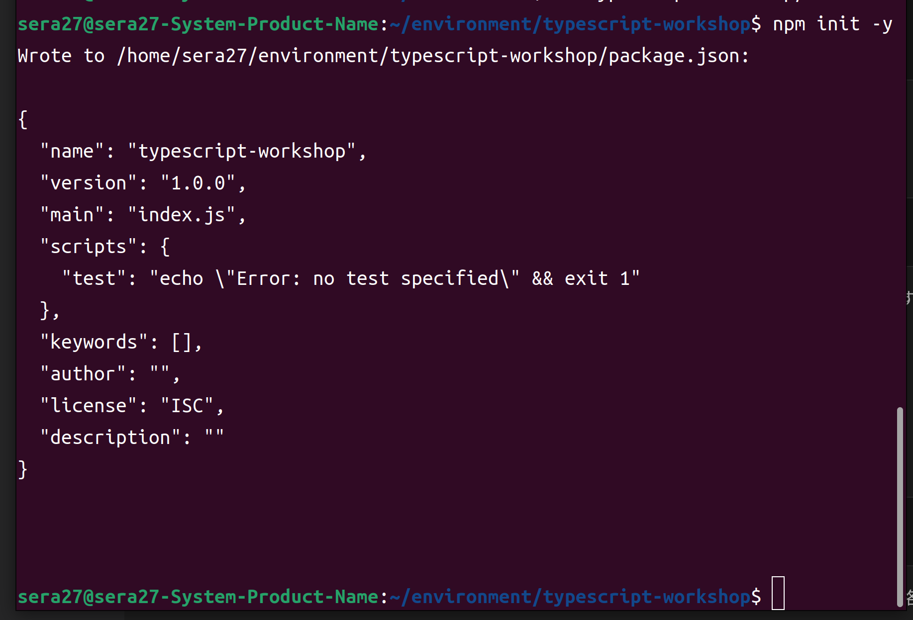
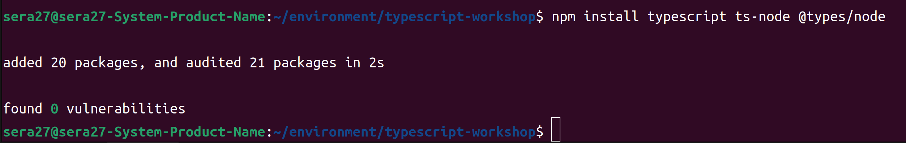
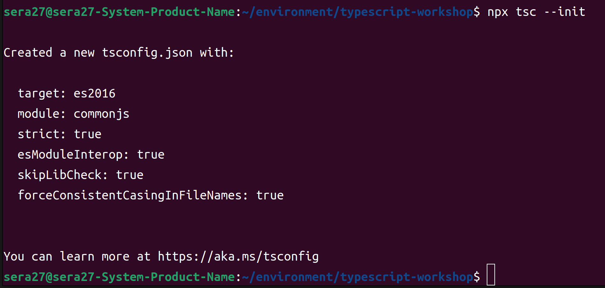
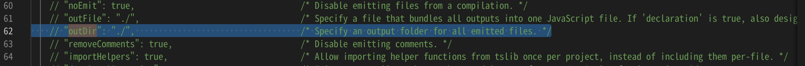
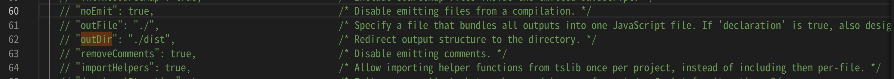
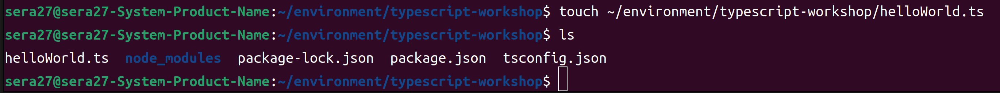
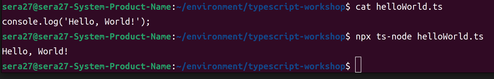

# 1. typescriptの概要

## JavaScriptとは
- JavaScriptは、当初ブラウザ（クライアント）上で簡単なスクリプトを実行するために使われており、複雑な利用は想定されていませんでした。   
- しかし、より良いユーザー体験を提供するために、JavaScript の実行エンジン最適化・API の追加などの改善が行われ、ブラウザ上で JavaScript コードが実行されることが増えてきました。  
- また、JavaScript を動かすための Node.js という実行環境も登場しました。これによって、JavaScript は様々な場所で使えるプログラミング言語となり、広く普及することになりました。  

## TypeScript が登場した経緯
- 当初、複雑な処理に利用されることが想定されていなかった JavaScript ですが、本格的に大規模なアプリケーションで利用されるにつれ、いくつかの課題があげられるようになりました。  
- 典型的な例をひとつ説明します。JavaScript は型をプログラムの実行時に評価する動的型付け言語なので、コンパイル時に型検査を行う静的型付け言語に比べ、実行時までエラーが発生することがわからないといった課題がありました。  
- プログラムを実行せずにコードの誤りを検出することを静的解析と呼びます。 TypeScript は、静的型付けを用いてエラーがないかどうかをチェックし、上記の JavaScript の課題を解決します。  

## JavaScript と TypeScript の関係性
- TypeScript はトランスパイラを通して JavaScript に変換されます。
- この変換の際に、TypeScript の型情報は消去され、実行時にはJavaScript として実行されます。
-  ライブラリに関しても、TypeScript は JavaScript と同じライブラリが使用できます。 TypeScript は JavaScript と構文やランタイムを共有しているため、エラーが出た際は JavaScript に関する情報が役に立つことも多いです。
  
## まとめ
- JavaScript は当初、ブラウザ上で簡単なスクリプトを実行するために利用されていましたが、利用が進むにつれ、いくつかの課題があげられるようになりました。
- TypeScript は JavaScript の課題を解決するために登場したプログラミング言語です。
- TypeScript は、トランスパイル時に型検査を行いますが、実行時は JavaScript として実行されます。コードを書いていてエラーが出た際も、これを意識ながらトラブルシューティングを行うと、スムーズにエラーが解決できる場合があります。
- Node.js は JavaScript をさまざまなプラットフォームで動かすための実行環境です。

***

<br><br><br>

# 2. パッケージについて

## パッケージについて
- パッケージとは、他の個人・団体が公開している再利用可能なコードを、自分のプログラムで使えるようにしたものです。
- パッケージを利用することで、よく使われるプログラムを自ら書く必要がなくなります。パッケージをプロジェクトにインポートすることで、そのパッケージの機能を利用できます。

- Node.js には一般的なパッケージが含まれていますが、他の多くのパッケージは Node.js のパッケージマネージャーである npm を使用してインストールする必要があります。
- プログラムが正しく機能するためには、こうしてインストールされたパッケージが正常に利用可能であることに「依存」しています。
- そのため、自分のプログラムは、これらのインストールされたパッケージに「依存性」がある、と表現します。
- パッケージは、自分たちのプログラム内だけでなく、プログラム間やコミュニティの他の開発者とコードを共有する方法を定義しています。
- このワークショップでは、パッケージをインストールし、使用することになります（AWS CDK もこの 1 つです）。
- パッケージの作成はこのワークショップでは扱いませんが、npm install と import を使用しているときは、他の人のコードをインストールして実行していることを意識してください。
- npm install コマンドによって、Node.js のパッケージマネージャーである npm を使用してパッケージをインストールします。
- import は一般的にコードの一番最初に宣言する構文で、インストール済みのパッケージなどのうち、コードの中で利用したいものを指定します。import については後ほど詳細に説明いたします。

## まとめ
- 他の個人・団体が公開している再利用可能なコードをパッケージという形で自分のプログラムで使用できます
- npm は Node.js のパッケージマネージャーです
- npm install でパッケージをダウンロードできます

<br><br><br><br><br><br>

# 3. プロジェクトの作成
- ここでは、TypeScript を使うプロジェクトを作成し、TypeScript 実行環境を設定してから Hello World と出力する簡単なプログラムを動かします。

## プロジェクトディレクトリの作成
空のディレクトリを作成し、カレントディレクトリを変更します。
```
mkdir typescript-workshop && cd ~/environment/typescript-workshop
```

## Step1 : 実行環境を設定する
### Node.js
- まず、Node.js が正しくインストールされていることを確認します。Node.js は JavaScript のランタイムです。

- 以降、各パッケージのバージョンを確認する際はこのドキュメントと異なる数字が表示される場合があります。
- コマンドプロンプトに node --version と入力し、Enter を押してください。 
```
Admin:~/environment $ node --version
v20.5.1
```

### npm
- 次に、npm がインストールされていることを確認します。 
- npm は Node.js のパッケージマネージャーで、パッケージをダウンロード、管理するために利用されます。

- コマンドプロンプトに npm --version と入力し、Enter を押してください。
```
Admin:~/environment $ npm --version
9.8.0
```

### npx
-次に、npx が正しくインストールされていることを確認します。
- `**npx は npm でインストールしたパッケージを実行するために利用されます。**

- コマンドプロンプトに npx --version と入力し、Enter を押してください。
```
Admin:~/environment $ npx --version
9.8.0
```

### プロジェクトの初期化
- 次に、以下のコマンドを実行します。

```
npm init -y
```

- このコマンドを通じて、package.json というパッケージに関する設定情報を記述するファイルが自動的に生成され、パッケージをインストールする準備（初期化処理）ができます。



- それでは、実際にパッケージをインストールしてみます。

### パッケージのインストール
- 以下のコマンドを実行してください。

```
npm install typescript ts-node @types/node
```


- これにより node_modules フォルダが追加され、インストールしたパッケージが格納されます。

- ここでは 3 つのパッケージtypescript、ts-node、@types/node がインストールされました。

- ```typescript``` パッケージは、TypeScript のコードを JavaScript のコードへ変換するために使用します。
- ```ts-node``` パッケージは、TypeScript ファイルを Node.js で直接実行するために使用します。
- ```@types/node``` パッケージには、この手順の後半で使う console.log に必要な Node.js の TypeScript のための型定義が含まれています。
### TypeScript の設定
- 次に、TypeScript の設定を追加します。

- まずは、初期化処理を実施し、tsconfig.json ファイルを生成します。 npx を使うことで、npm でインストールした TypeScript Compiler (tsc) を実行することができます。

```
npx tsc --init
```



- ここから、生成した ```tsconfig.json``` を編集して設定を行います。

- ```dist``` を出力先フォルダとしてプロジェクトの設定に追加します。
- ```tsc``` を使ってコマンドを実行すると、TypeScript のコードは Node.js で実行可能な JavaScript に変換されます。
- このプロセスは**トランスパイル**と呼ばれます。
- ```dist``` フォルダには、この生成された JavaScript ファイルが、私たちが書いている TypeScript のロジックとは別に保存されるようになります。
<br>
- tsconfig.json を開き、以下の行を変更します。

```
// "outDir": "./",                        /* Redirect output structure to the directory. */
```

- 以下のように変更します。

```
"outDir": "./dist",                       /* Redirect output structure to the directory. */
```




- 以上で設定は完了です。

<br><br>

## Step2 : コードを追加する
- helloWorld.ts という名前のファイルを作成します。

```
touch ~/environment/typescript-workshop/helloWorld.ts
```



- helloWorld.ts ファイルを開き、以下のコードを入力します。

```
console.log('Hello, World!');
```
- ctrl＋S でファイルを保存します。

<br><br>

## Step3: コードを実行する
- ts-node を使って helloWorld.ts を実行すると、以下のような出力が表示されます。

```
Admin:~/environment $ npx ts-node helloWorld.ts
Hello, World!
```


- 以降、コードを実行する際はファイルを保存したのち、以下のように ts-node を実行します。

```
Admin:~/environment $ npx ts-node ファイル名
```

(npx は npm でインストールしたパッケージを実行するために利用されます。)

<br>

## まとめ
- npm init でローカルプロジェクトを作成しました。
- npm install でパッケージをインストールしました。
- npx tsc --init で TypeScript のプロジェクトを作成しました。
- TypeScript プログラムを追加し、実行しました。
