# スケーラブルサイト構築

# **1. VPCの構築**
<br>

**今回構成するVPCの完成図**


<br><br><br>

***

### **1-1. VPC作成ウィザードでのVPC作成**
<br>

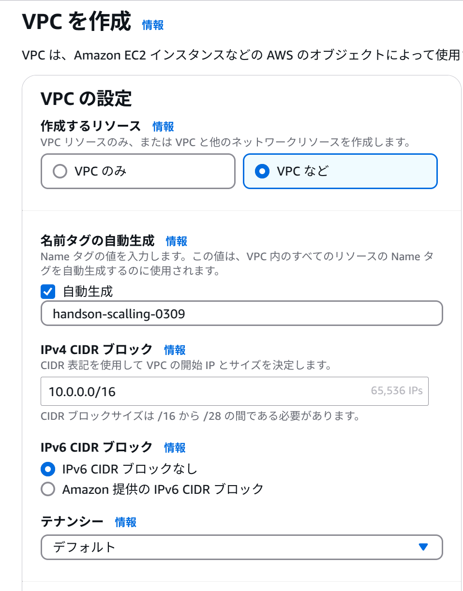

1. 作成するリソース→VPCなど
2. 名前タグの自動生成→任意の名前を入力(今回はhandson-scalling-0309と入力)
3. IPv4 CIDRブロック→デフォルトのまま(**10.0.0.0/16**)
4. IPv6 CIDRブロック→IPv6 CIDRブロックなし
5. テナンシー→デフォルト
<br>

***

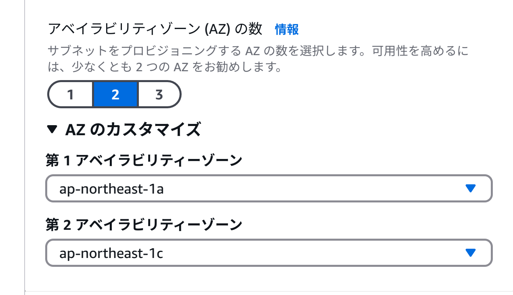

6. AZの数→**2**
7. AZのカスタマイズ
- 第1アベイラビリティゾーンが「**ap-northeast-1a**」
- 第2アベイラビリティゾーンが「**ap-northeast-1c**」になっていることを確認。  
<br>

***

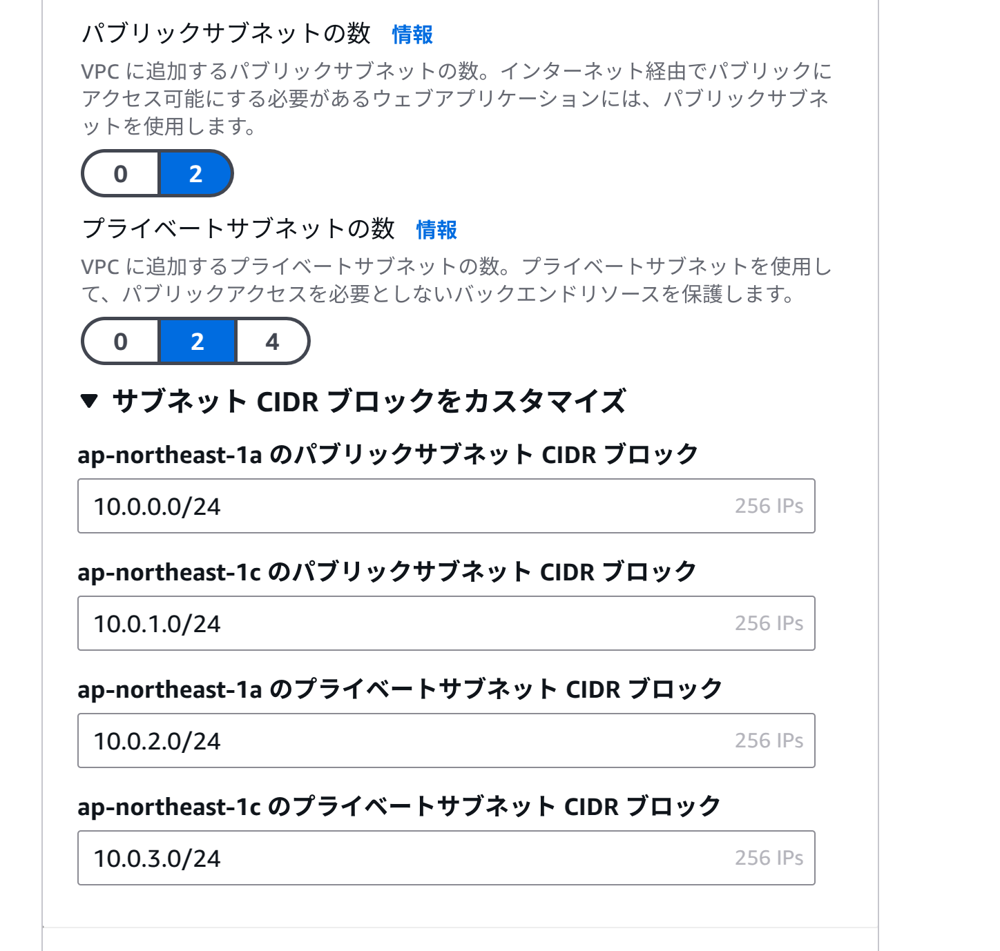

8. パブリックサブネットの数→**2**
9. プライベートサブネットの数→**2**
10. **サブネットCIDRブロックをカスタマイズ**<br>10-1. ap-northeast-1aのパブリックサブネット→**10.0.0.0/24**   
10-2. ap-northeast-1cのパブリックサブネット→**10.0.1.0/24**   
10-3. ap-northeast-1aのプライベートサブネット→**10.0.2.0/24** 
10-4. ap-northeast-1cのプライベートサブネット→**10.0.3.0/24**  
<br>

***

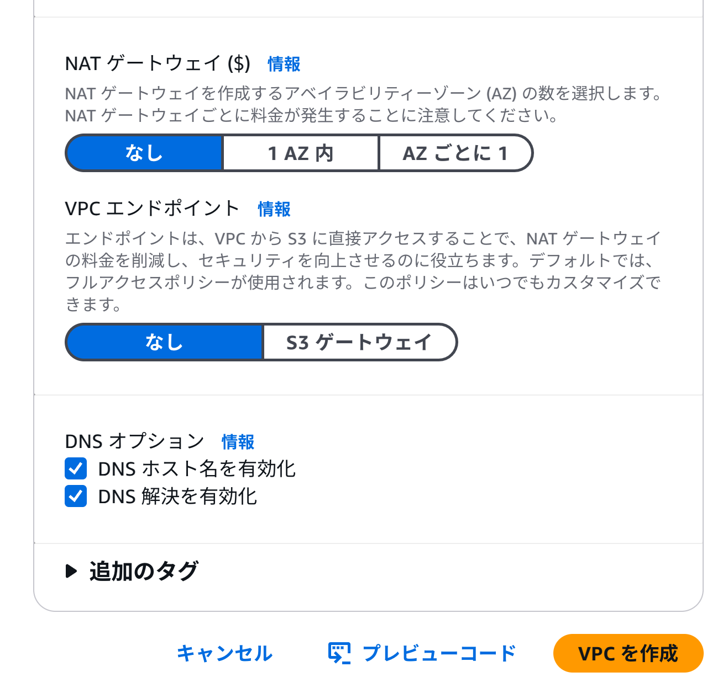

11. NATゲートウェイ→**なし**
12. VPCエンドポイント→**なし**
13. DNSオプション→両方ともチェックが入ったままにしておく
14. VPCを作成ボタンを押下
<br>

***

完成

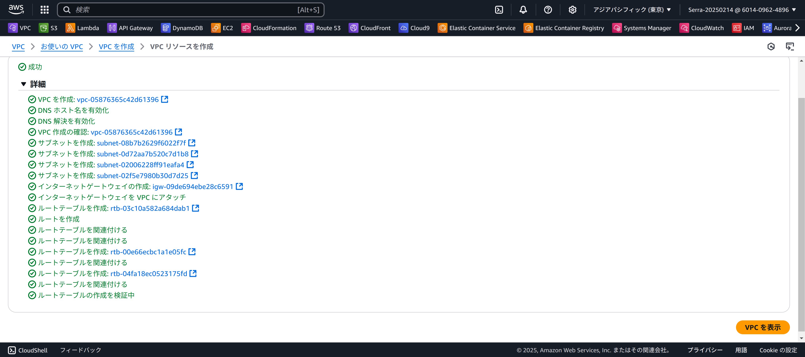　


<br>

***


### **1-2. VPCのフィルタリング**
<br>
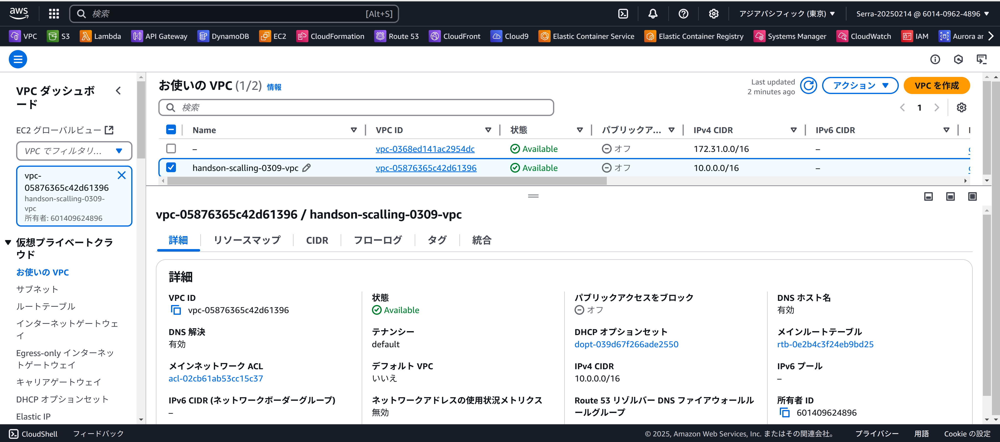

1. 画面左にある VPC でフィルタリング のプルダウンメニューから作成した VPC を選択。
<br>

***

### **1-3. 作成したVPCを確認**
**作成したVPCを表示**
1. 画面左上にある お使いの VPC をクリックし、作成した VPC を確認します
<br>

***

**作成したVPCを確認**
1. 作成した VPC (handson-scalling-0309) が存在するか（正しく絞り込めているか）を確認
2. IPv4 CIDR が 10.0.0.0/16 であることを確認
<br>

***

### **1-4. VPCの名前を変更**

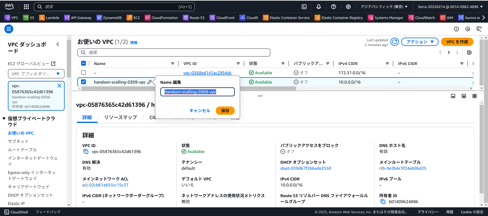

1. vpc名の右側のアイコンをクリック（VPC名の文字の上にマウスを当てると、アイコンが表示される）
2. 任意の名前に変更
3. 保存をクリック
<br>

***

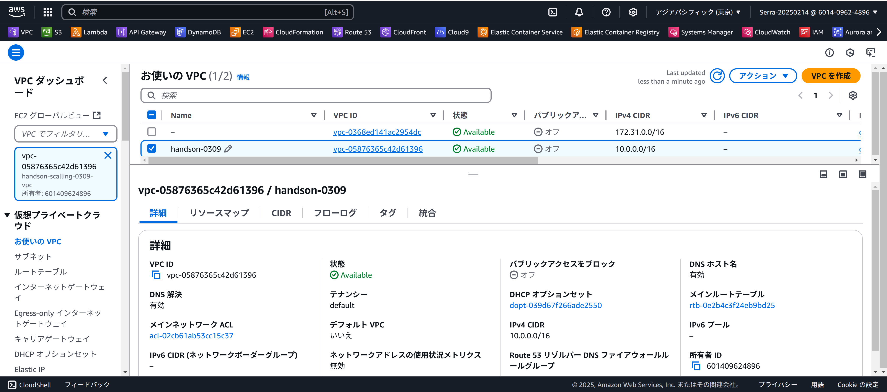

4. VPC 名が変更されました。
<br>

***

### **1-5. サブネットの名前を変更**

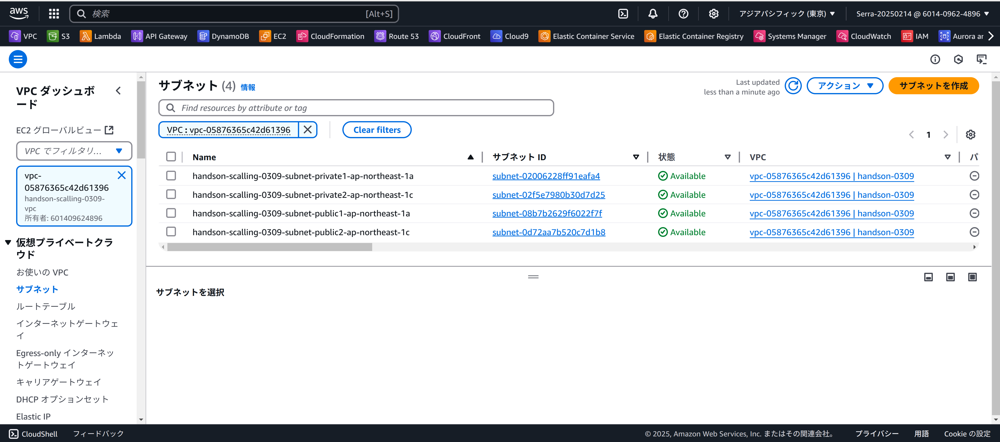

1. 左側から「サブネット」をクリック
2. サブネットが 4 つ表示されることを確認。(もし、サブネットが4つ以上表示されている場合は、一度ブラウザをリロードして、再度 VPCでフィルタリングを行う)
3. handson-scalling-0309-public1-ap-northeast-1a を一覧から探して、右側のアイコンをクリックします
4. 名前を パブリックサブネット-1a に変更
5. 保存をクリック
<br>

***

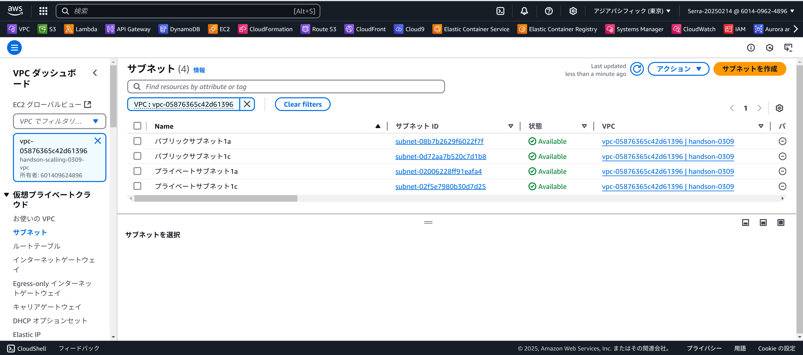

6. 4つ全てのサブネットの名前 をそれぞれ、以下のテーブルに沿って、全て変更
<br>

***

### **1-6. 名前を変更したサブネットを確認**

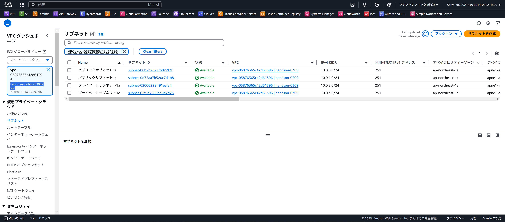
<br>

***

### **1-7. 完了**


<br>

***

<br><br><br><br><br><br><br><br><br><br><br><br><br><br><br><br><br><br><br><br><br><br><br><br><br><br><br><br><br><br><br><br><br><br><br><br><br><br>

# 2. Amazon EC2 の作成


## 2-a. Amazon EC2の作成

**目標**-WordPress がインストールされた EC2 インスタンスを パブリックサブネット-1a 上に 1つ 作成します。

***

### 2-1. EC2 インスタンスの作成
インスタンスを起動をクリック

***

### 2-2. 作成する EC2 インスタンスの名前を入力
名前とタグに任意の名前を入力(今回はhandson0309ec2と入力)

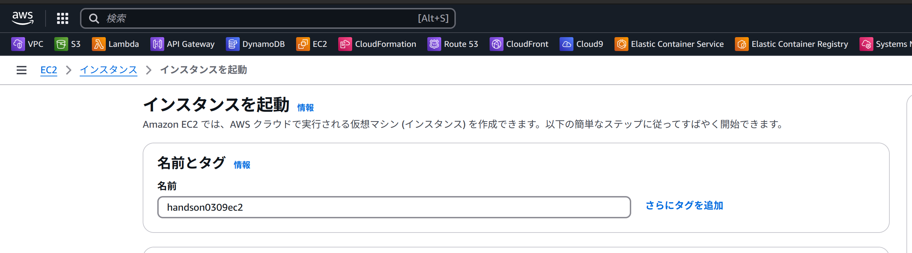

***

### 2-3. 使用する AMI を選択
今回は、EC2 インスタンスの OS は Amazon Linux 2023 を使用

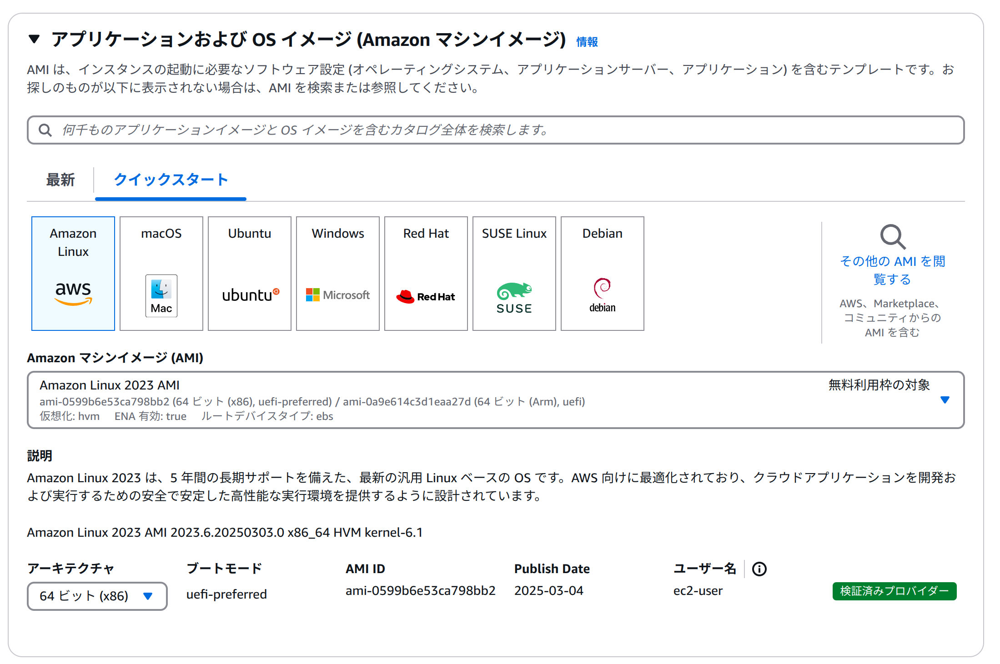

***

### 2-4. インスタンスタイプの選択  
Amazon EC2 では、異なるユースケースに合わせて最適化されたさまざまなインスタンスタイプが用意されている  
今回はデフォルトの **t2.micro** インスタンスを選択。

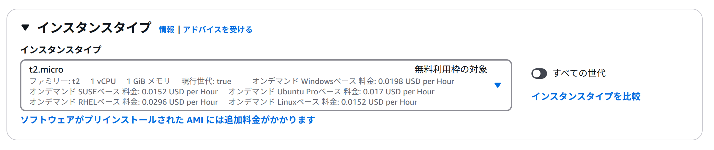

***

### 2-5. キーペアの設定
「キーペア名」に キーペアなしで続行 を選択
(AWS Systems Manager Session Manager で EC2 インスタンスに接続を行う為、SSHキーペア(SSHでのログイン)は使用しない)  

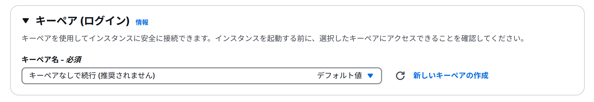

***

### 2-6. ネットワーク設定  
EC2 インスタンスを、パブリックサブネット-1a 上に作成するため、ネットワーク設定とファイアーウォール(セキュリティグループ)の設定を行います。  

1. 「ネットワーク設定」の右にある 編集 をクリック
2. 「VPC」で 今回作成したハンズオン用 VPC を選択 (今回は: handson-0309)
3. 「サブネット」で パブリックサブネット-1a を選択
4. 「パブリック IP の自動割り当て」で 有効化 を選択  

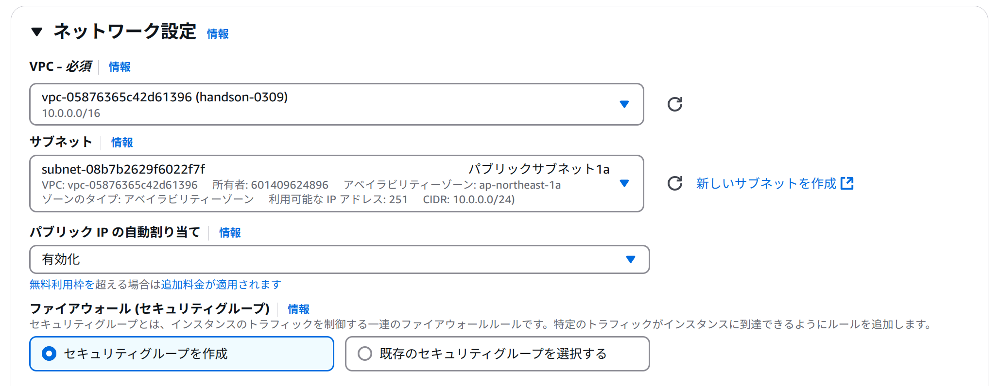

5. 「ファイアウォール (セキュリティグループ)」で セキュリティグループを作成する を選択
6. 「セキュリティグループ名」「説明」ともに web-ユーザ名 (例: web-user1) と入力
7. 「インバウンドセキュリティグループのルール」で、すでに表示されている セキュリティグループルール 1 を変更していきます
8. 「タイプ」を ssh から HTTP に変更
9. 「ソースタイプ」を 任意の場所 から 自分のIP に変更します。そして、「ソース」に 自分のグローバルIPが表示されていることを確認 (図で マスキングされている部分)

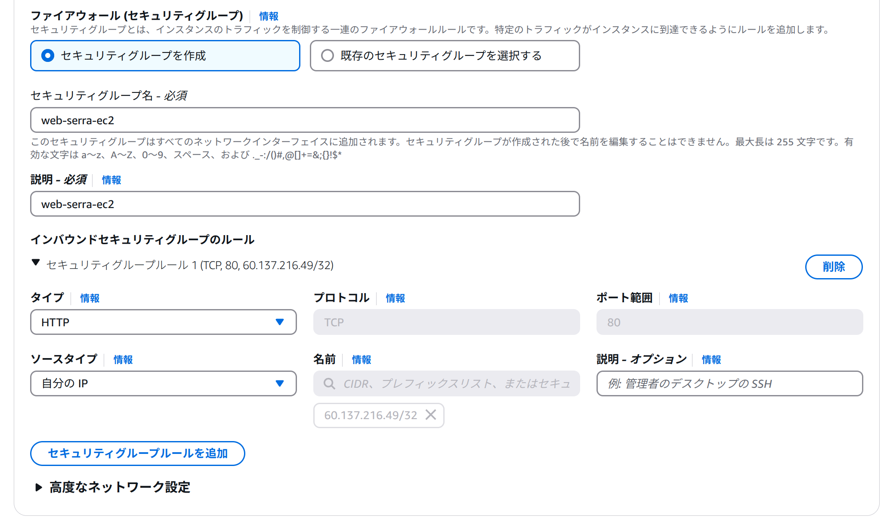

10. 「高度なネットワーク設定」は、なにも変更せず（デフォルトのまま）します。次に、ストレージ設定を行います。

***

### 2-7. ストレージ設定
デフォルト のまま（ 8 GiB / gp3 ルートボリューム）にします  

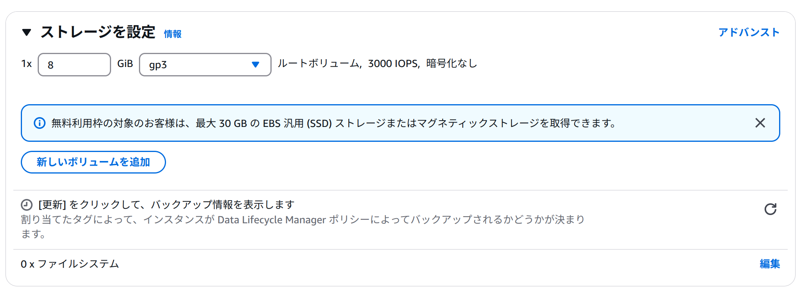

***

### 2-8. 高度な設定（ IAM ロールの設定とWordPressの自動インストール ）
- EC2 インスタンスの初回起動時に自動で後述のスクリプトを実行し、WordPress の自動インストールを行います。

#### 2-8-1. 「高度な詳細」を展開
**高度な詳細** をクリックして展開して、一番下にある **「ユーザーデータ」** までスクロールする。

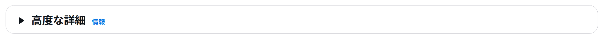

#### 2-8-2. WordPress インストールスクリプトの設定  
<u>以下のコード</u>をコピーして貼り付ける

```
#!/bin/bash

dnf update -y
dnf install -y httpd wget php-fpm php-mysqli php-json php php-devel mariadb105

wget http://ja.wordpress.org/latest-ja.tar.gz -P /tmp/
tar zxvf /tmp/latest-ja.tar.gz -C /tmp
cp -r /tmp/wordpress/* /var/www/html/
chown apache:apache -R /var/www/html

systemctl enable httpd.service
systemctl start httpd.service 
```

<br>

**「ユーザーデータは既に base64 エンコードされています」のチェックは外したままにします**

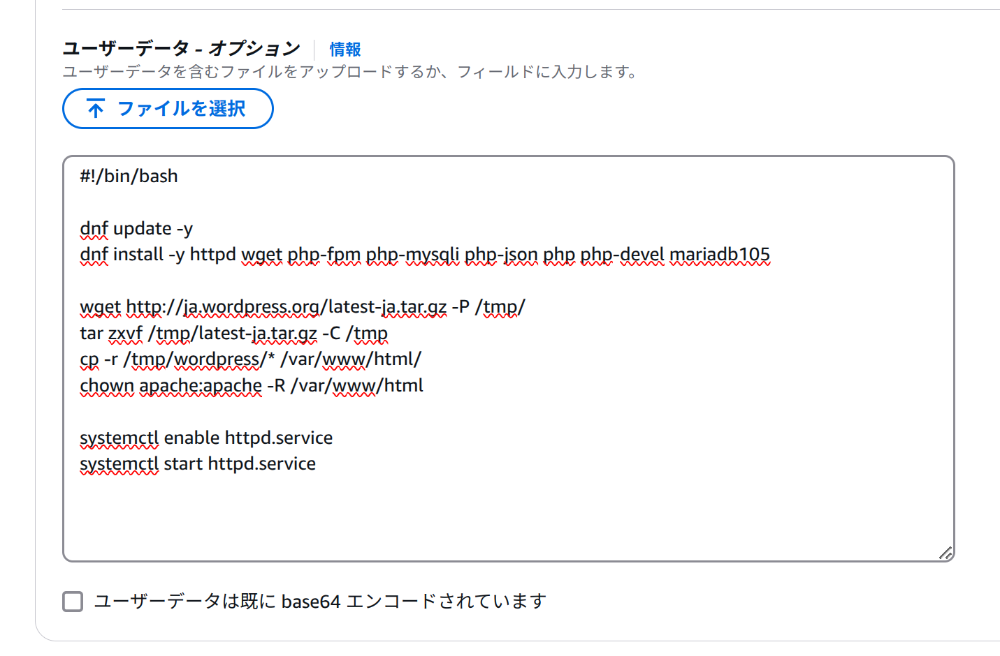

***

### 2-9. EC2 インスタンスの起動
念の為、入力した項目に間違いがないか確認を行う。  
間違いがないことを確認したら、「概要」から インスタンスを起動 をクリックして、インスタンスを起動する。

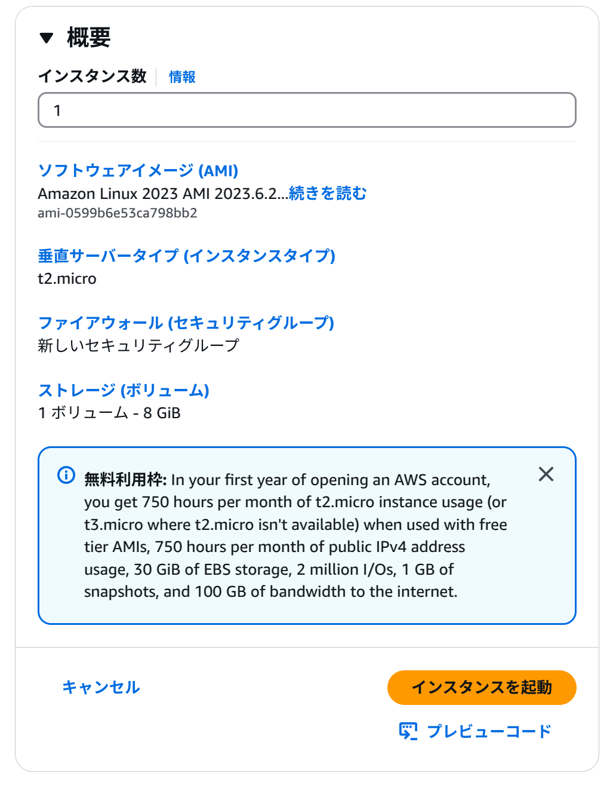

***

### 2-10. 起動の確認

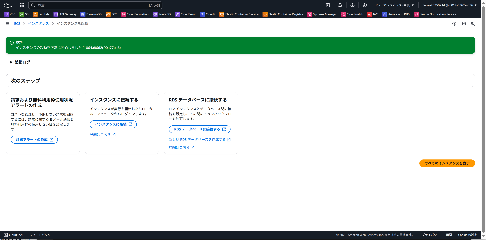

***

## 3. 作成した EC2 インスタンスを確認
作成したインスタンスが表示(図の場合 webserver#1-user1)されるので、名前の横のチェックボックスにチェックを入れます。

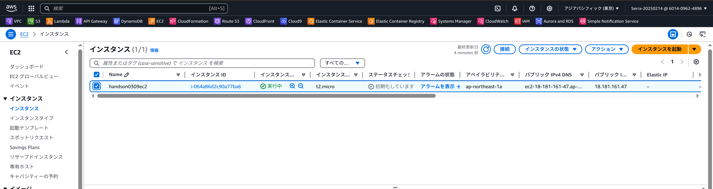

***
## 4. 作成した EC2 インスタンスの詳細設定を確認
画面下の詳細タブをクリックし、以下の項目を確認。

1. パブリック IPv4 アドレスが割り当てられていること
2. インスタンスタイプが t2.micro になっていること
3. VPC ID が、今回作成した VPC になっていること
4. サブネット IDが、パブリックサブネット-1a になっていること

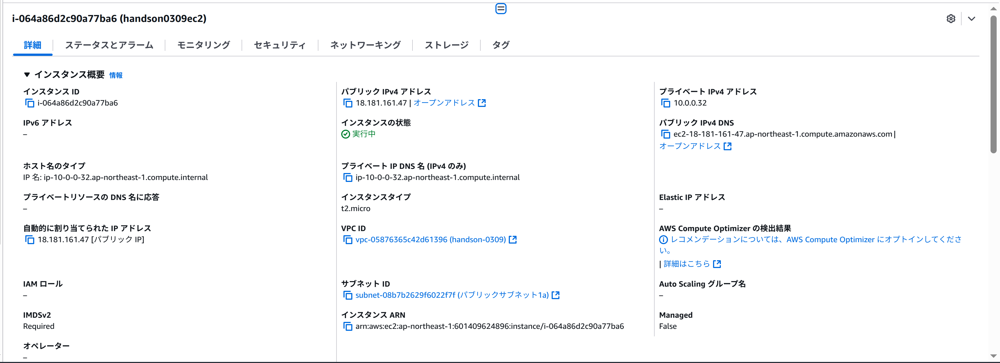

***

## 5. 作成した EC2 インスタンスのセキュリティ設定を確認
セキュリティタブをクリックし、セキュリティグループが適切に設定できているか確認。

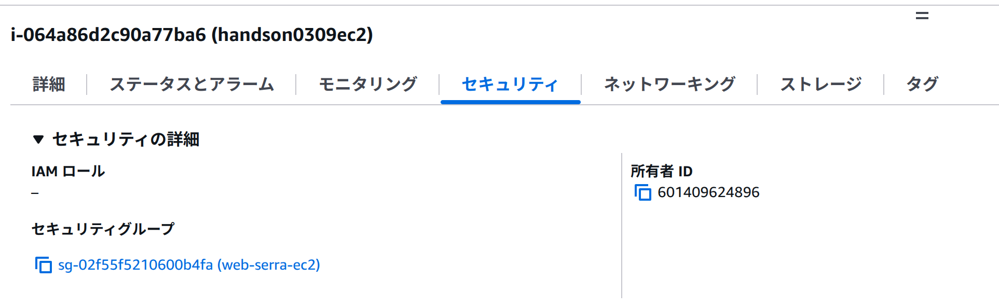

***

## 6. 完了  
ここで行ったこと。(仮の画像　実際は自分でdraw.ioで作成しとく)

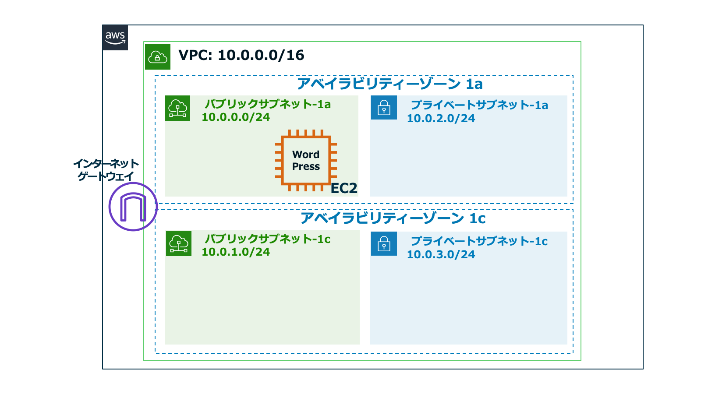

***
<br><br><br>

# 2-b WordPress のインストール確認
ここで行うこと
先ほど作成した EC2 インストール上に、WordPress が正常にインストールされていることを確認します。

手順
1. WordPress がインストールされていることを確認
1-1. 前の手順で確認した パブリックIP v4 アドレスをコピーします

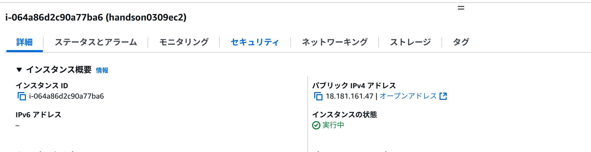

***

1-2. 別ブラウザや別タブを立ち上げて、アドレスにコピーしたIPアドレスを入力します

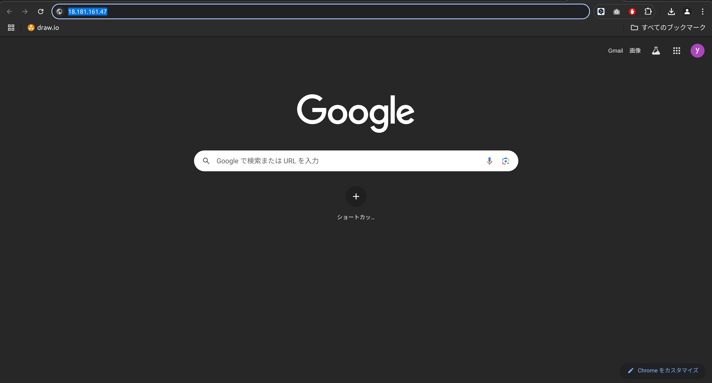

***
1-3. WordPress 初期設定画面が表示されることを確認します

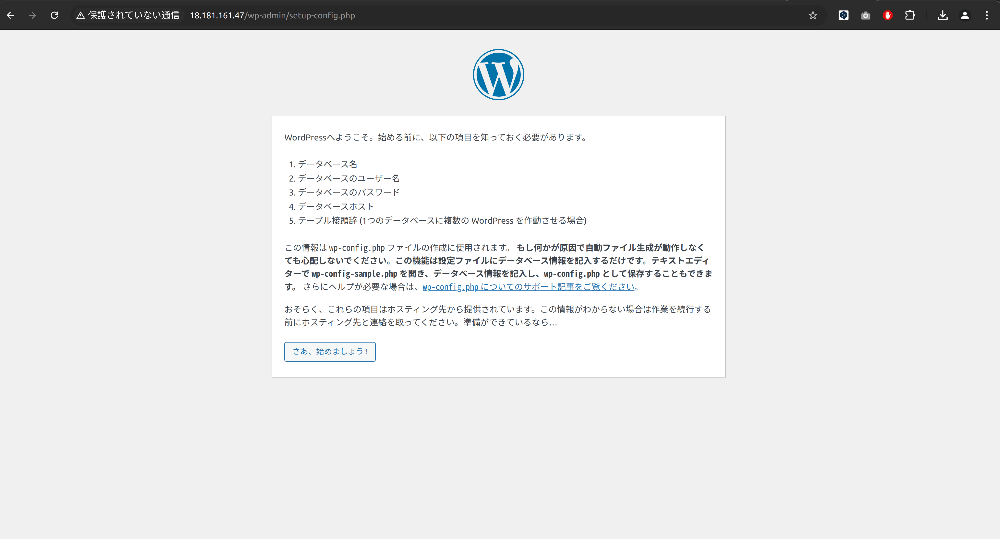

***

1-4. 確認後、WordPressが表示されているブラウザやタブを閉じます

***
<br><br><br><br><br><br><br><br><br><br><br><br><br><br><br><br><br><br><br><br><br><br><br><br><br><br><br><br><br><br>

# 3. Amazon RDS の作成
(仮の画像　実際は自分でdraw.ioで作成しとく)
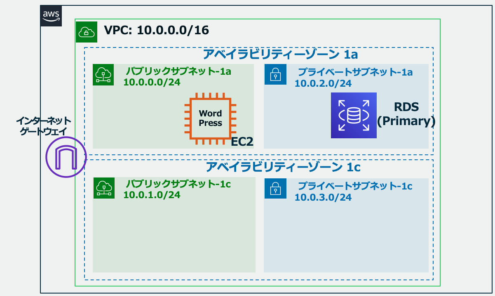


## 3-a. DB 用セキュリティグループの作成
ここで行うこと
- RDS DB インスタンス作成前に、まず、DB 用のセキュリティグループ(ファイアウォール)を作成します。

***

### 3-a-1. DB 用セキュリティグループを作成

1-1. EC2 管理ページを開く  
検索ボックスで ec2 と入力し、表示された EC2 をクリック 

***
1-2. セキュリティグループを作成
左側一覧からセキュリティグループをクリック
セキュリティグループを作成をクリック

***

1-3. セキュリティグループの設定  
##### 1. 基本的な詳細
1-1. セキュリティグループ名に db-ユーザ名と入力：(例）db-user1  
1-2. 説明に RDS for MySQL と入力  
1-3. ハンズオン用に作成した VPC を選択 (例: handson-0309)  

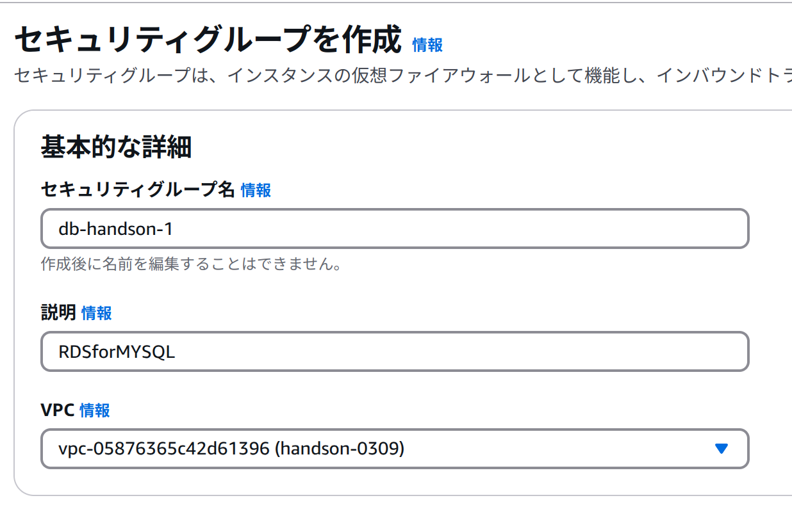

##### 2. インバウンドルール
2-1. インバウンドルールのルールの追加 をクリック  
2-2. カスタムTCP を MYSQL/Aurora に変更  
2-3. ソースをプルダウンから カスタム に変更  
2-4. web と入力し、セキュリティグループの候補を表示させる  
2-5. EC2 インスタンス作成時に作成したセキュリティグループを選択する (例) web-user1  

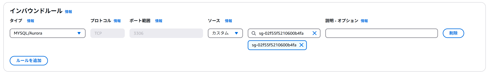

##### 3. その他
アウトバウンドルールやタグはデフォルトのまま、画面下のセキュリティグループを作成 をクリック

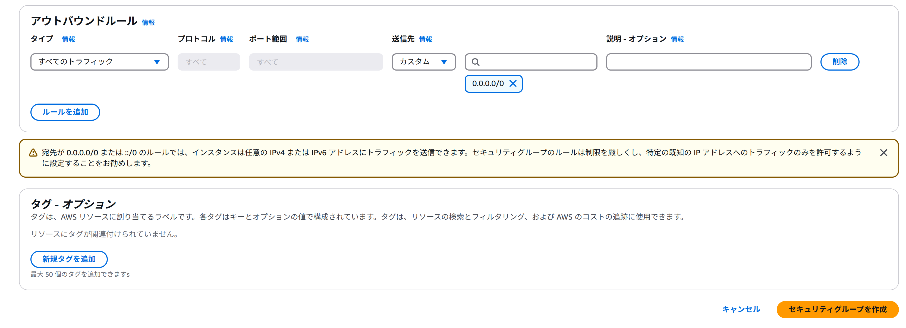

***

### 1-4. 作成したセキュリティグループの確認
セキュリティグループ作成後に以下の画面が表示されます。

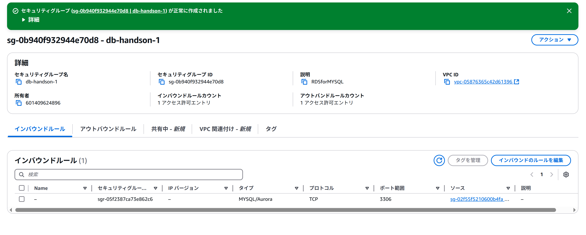

以上で、RDS（DB）用のセキュリティグループの作成は終了です。


# 3-b. DB サブネットグループの作成
これから行うこと
RDS 作成の事前準備として、DB サブネットグループを作成します。

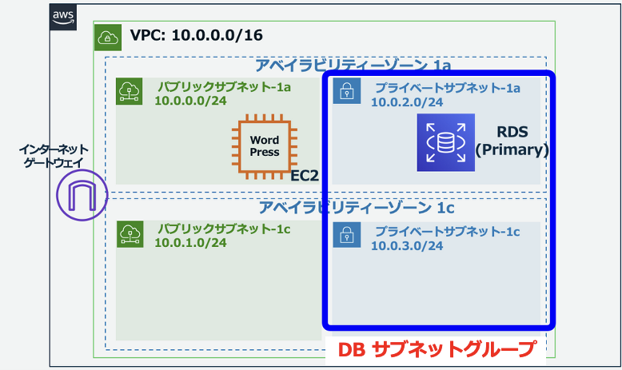


**DB サブネットグループ  は、データベースを作成するサブネット群のことです。異なるアベイラビリティゾーンで最低2つのサブネットから構成されている必要があります。 EC2 インスタンスでは、作成時にサブネットを直接指定しましたが、RDS では、サブネットではなく、DB サブネットグループを作成時に指定する必要があります。**

***

## 3-b-1. DB サブネットグループを作成

### 1-1. RDS 管理ページを開く
検索ボックスで rds を入力し、表示された RDS をクリック

***

### 1-2. DB サブネットグループを作成
作成済みの2つのプライベートサブネット(1aと1c)を使って、DB サブネットグループを作成します。

左側のペインから サブネットグループ をクリック
DB サブネットグループの作成 をクリック

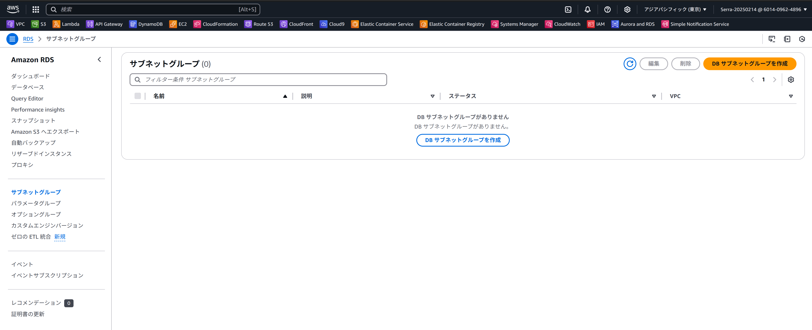

***

### 1-3. DB サブネットグループの設定  
1. 名前に db-subnet-ユーザ名と入力 (例）db-subnet-user1  
2. 説明に RDS for MySQL と入力  
3. ハンズオン用に作成した VPC を選択 (例）handson-user1  

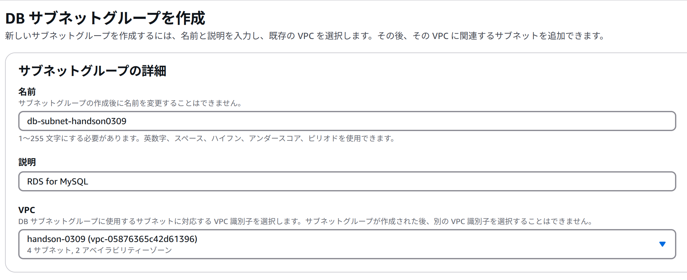

***

### 1-4. RDS を作成する アベイラビリティーゾーンの指定
アベイラビリティゾーンの選択で ap-northeast-1a と ap-northeast-1c にチェック

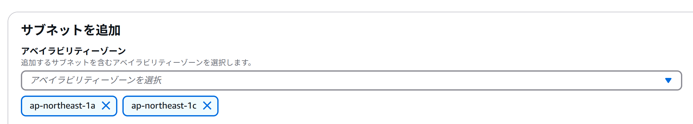

***

### 1-5. RDS を作成する サブネットの指定  
ap-northeast-1c から 10.0.3.0/24のサブネットにチェック ( サブネット名が表示されませんが、プライベートサブネット−1c です)  
ap-northeast-1a から 10.0.2.0/24のサブネットにチェック ( サブネット名が表示されませんが、プライベートサブネット−1a です)  
作成 をクリック  

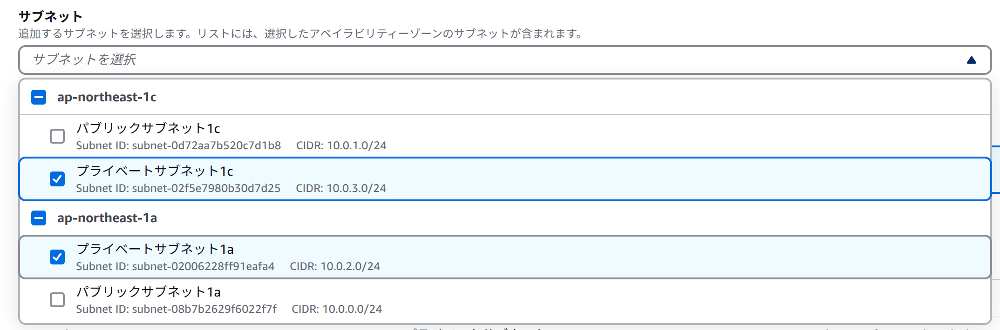

***

### 1-6. DB サブネットグループの作成確認  
下図のように db-subnet-ユーザ名 というサブネットグループが作成されたことを確認します (例) db-subnet-user1

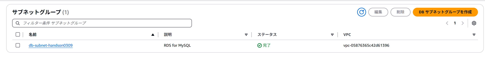

以上で、DB サブネットグループの作成は終了です。次に、RDS DB インスタンスを作成していきます。

***

## 3-c. Amazon RDS の作成
ここで行うこと  
WordPress が使用するデータベースとして Amazon RDS for MySQL インスタンスを プライベートサブネット-1a 上に シングル AZ 配置 で作成します。

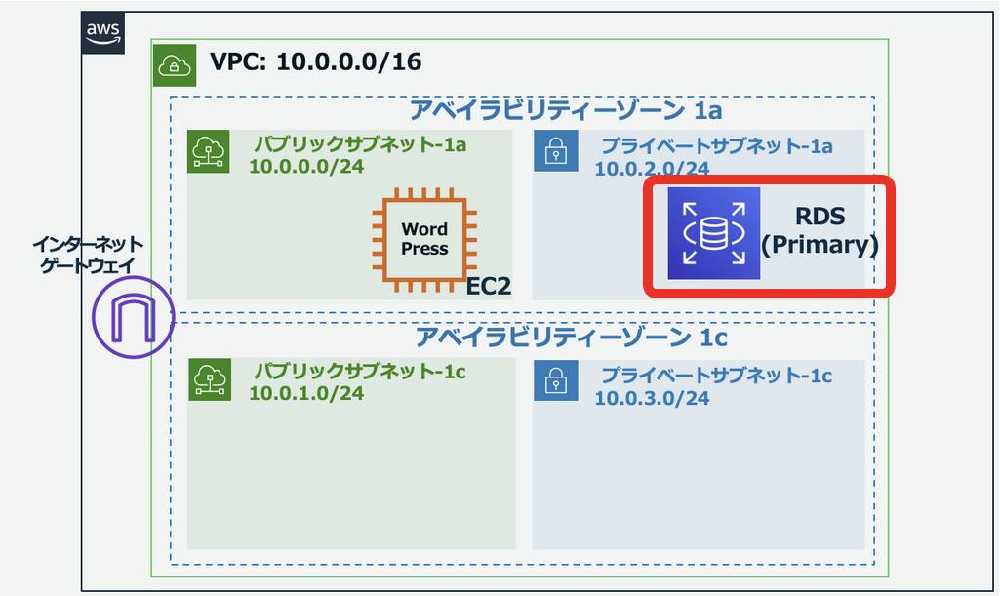

***

3. RDS インスタンスを作成
Amazon RDS for MySQL DB インスタンスの作成を行います。

ここでは、シングル AZ 配置で作成を行い、後の手順で、マルチ AZ 配置へ変更を行います。

左側のペインから データベース をクリック
データベースの作成 をクリック

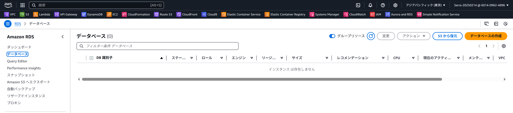

***

### 3-1 データベース作成方法を選択
1. 標準作成 を選択します

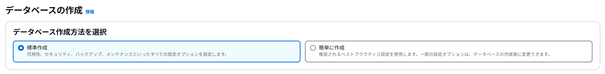

***

### 3-2. エンジンのオプションとテンプレートの設定
1. エンジンのタイプから MySQL を選択。（注意！ Aurora(MySQL) ではなく、MySQL を選択してください）
2. バージョンは デフォルトで選択されているバージョン のままにします。

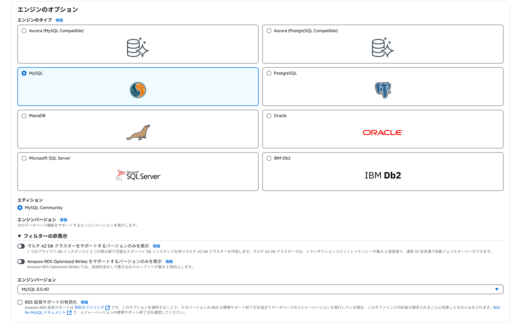

3. テンプレートを 無料利用枠 にします。

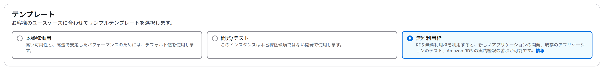


4. その次の、可用性と耐久性 はデフォルトのままにします

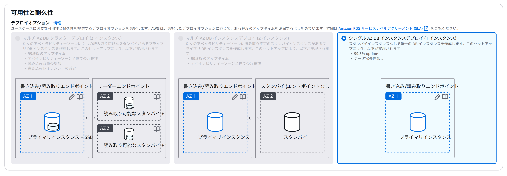

***

### 3-3. データベースの設定
1. DB インスタンス識別子(DBインスタンスの名前)に 任意の名前(ここではrds-handson0309) と入力  
2. マスターユーザー名に admin と入力  
3. 認証情報管理で セルフマネージド を選択  
4. マスターユーザー(admin) のパスワードを入力(1cv435y8r87o9pcay3ytkdge9t)  
(入力したパスワードは、あとで利用するため、メモ帳に一時的に保存するなどして忘れないようにしてください)  

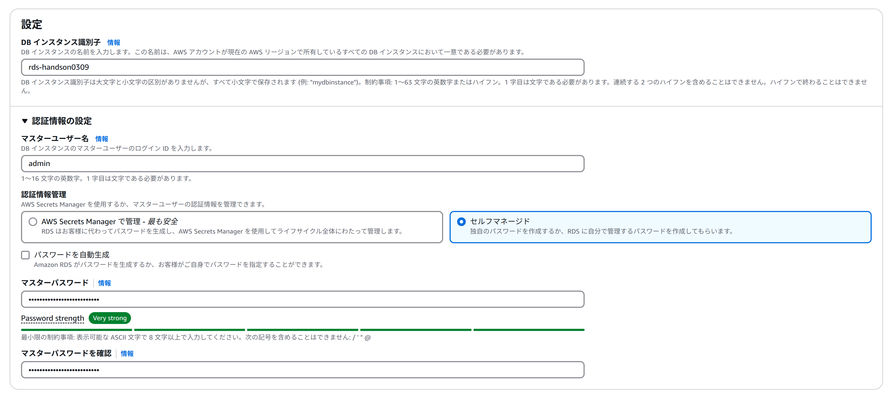

***

### 3-4. DB インスタンスサイズ/ストレージの設定(デフォルトのまま)
DB インスタンスサイズ / ストレージ の設定は、デフォルトのままで変更しません

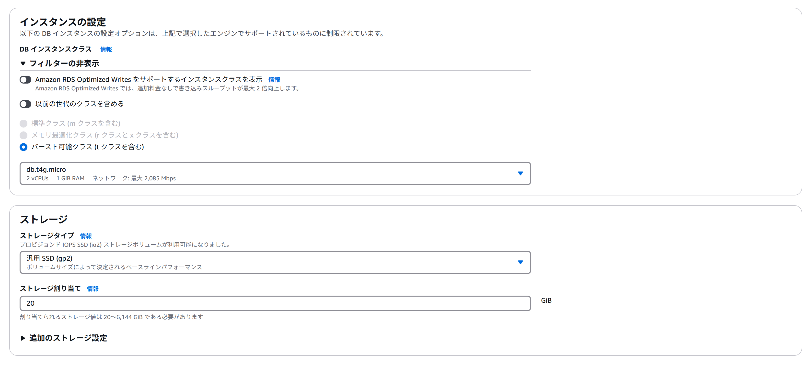

***

### 3-5. ネットワーク設定  
接続設定  
1. EC2 コンピューティングリソースに接続しない を選択  
2. VPC に 自分のVPC を選択 (例) handson-user1  
3. サブネットグループに、さきほど作成した自分のDBサブネットグループ db-subnet-user1 (db-subnet-ユーザ名)  
4. パブリックアクセスは なし にします  

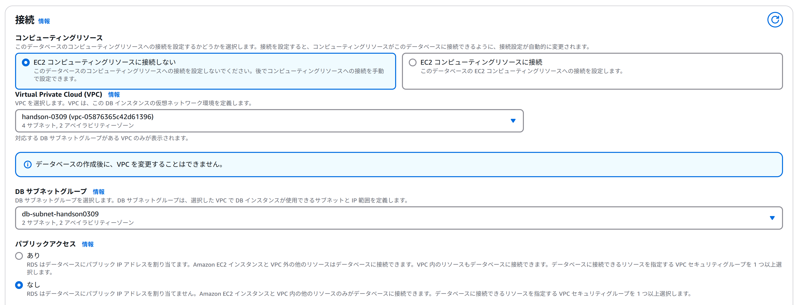

***

セキュリティグループ設定
1. VPC セキュリティグループは 既存の選択 を選択
2. 既存のセキュリティグループのプルダウンから、さきほど作成した db-user1 のセキュリティグループを選択 (やや作業が分かりにくいため、補足を参考にしてください)
3. セキュリティグループに db-user1 と default の2つセキュリティグループが選択されている場合は、 defaultを削除します (やや作業が分かりにくいため、補足を参考にしてください)
4. アベイラビリティーゾーンは ap-northeast-1a を選択
5. 「RDS Proxy を作成」のチェックは外したまま(デフォルトのまま)にします
6. 認証機関 は、デフォルトのままにします
7. 追加の接続設定は デフォルトのまま(3306) にします

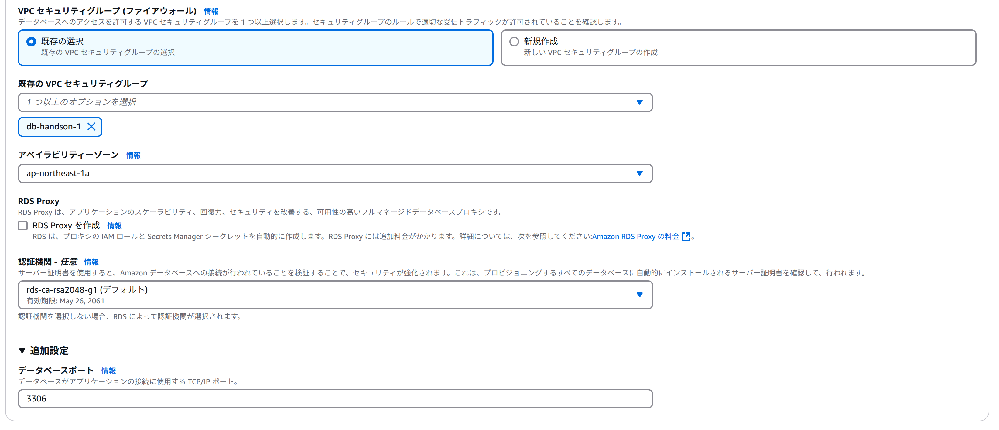

***

### 3-6. データベース認証 & モニタリング(デフォルトのまま)
データベース認証は、デフォルトのまま(パスワード認証) にします
モニタリングも、デフォルトのまま(拡張モニタリングのチェックが外れた状態)にします

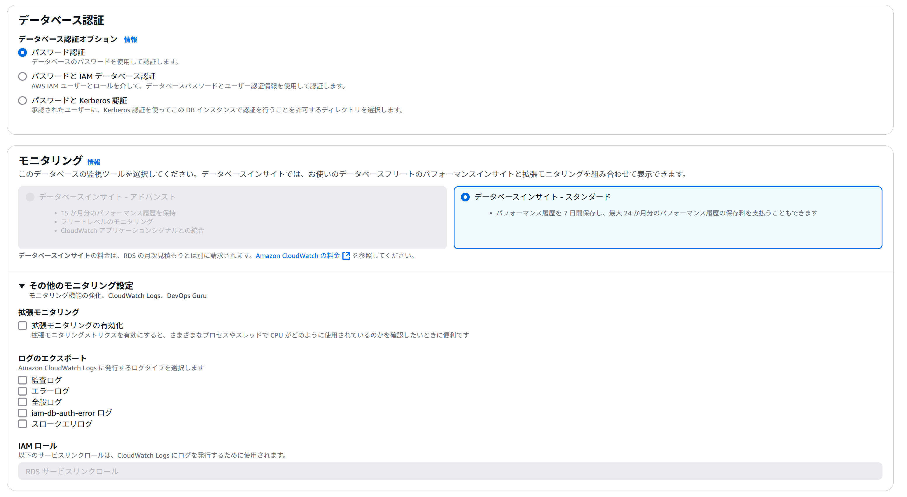

***

### 3-7. 追加の設定
1. 「追加設定」をクリックして展開します。最初のデータベース名に wordpress と入力（入力し忘れると、RDSの再作成が必要になるので、入力し忘れないように注意）  
2. 自動バックアップを有効化にしますの チェックを外して 、自動バックアップを無効にします  
3. 暗号を有効化の チェックを外して、暗号化を無効にします  
4. 監査ログ、エラーログ、全般ログ、スロークエリログの チェックをすべて外します  
5. 上記以外の項目は、デフォルトにままにします  

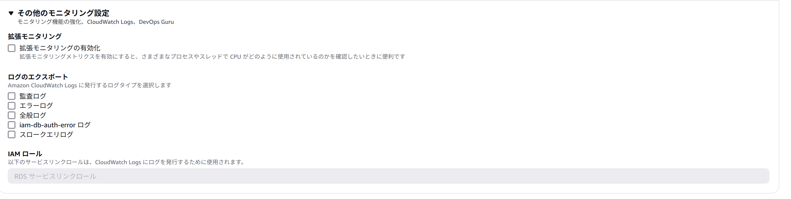
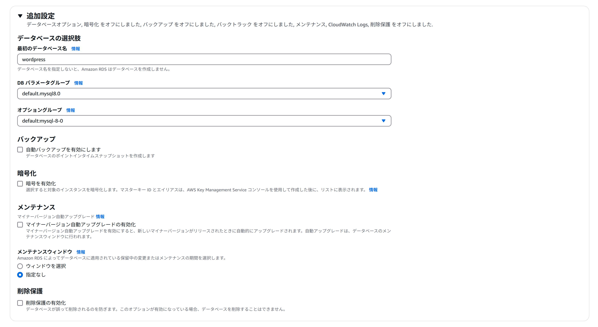

***

### 3-8. データベースの作成
データベースの作成 をクリックし、DB インスタンスを作成します
もし、「推奨アドオン」というページが表示された場合は、「閉じる」を選択して、次の手順に進んでください。ページが表示されない場合は、そのまま次の手順に進んでください。

***

### 3-9. 作成した DB インスタンスの確認
3-9-1. DB インスタンスの作成完了まで待ちます  
DB インスタンスの作成には 5分程度かかります。作成中は下図のように ステータスが 作成中 になっています  
DB インスタンスが作成されるまで待ちます  
作成完了（ステータスが利用可能）になれば、作成した DB インスタンスの詳細を確認するため、DB識別子の rds-user1 (rds-ユーザ名) をクリックします。  

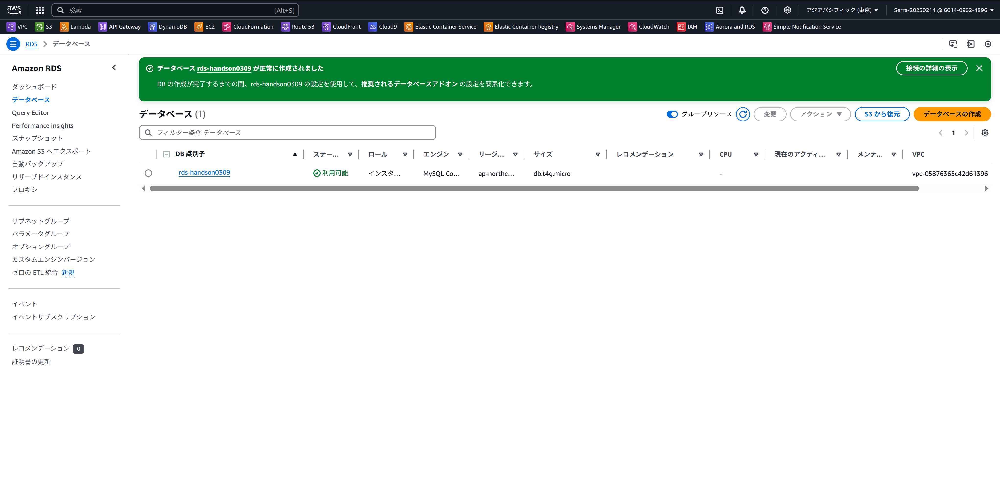

***

3-9-2. 作成した RDS インスタンスの設定を確認
作成した DB インスタンスの設定を確認します。

DBの接続先である エンドポイント をメモします。後で使用します。 (スクリーンショットで rds-user1.cojf494u4ptw.ap-northeast-1.rds.amazonaws.com となっている箇所です)  
rds-handson0309.cefn1fu8eeb7.ap-northeast-1.rds.amazonaws.com  
アベイラビリティゾーンが ap-northeast-1a になっていることを確認  
VPC が 自分の VPC になっていることを確認 (例) handson-user1  

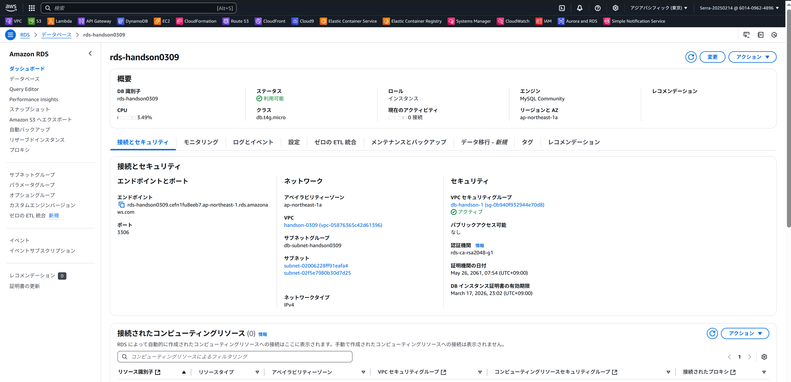

おめでとうございます！以上で、データベース(RDS DB インスタンス) の作成が完了しました。

***
<br><br><br><br><br><br><br><br><br><br><br><br><br><br><br><br><br><br><br><br><br><br><br><br><br><br><br><br><br><br><br><br><br><br><br><br><br><br>

# 4. ELB の作成
本セッションでは、ロードバランサー(ELB)を作成し、作成済みの EC2 インスタンス(WordPress) をロードバランサー配下に登録します。

まず、ELB ターゲットグループ（ロードバランサーに登録する EC2 インスタンスグループ）を作成します。

1. ELB 作成の事前作業（ターゲットグループの作成）
### 1-1. EC2 管理ページを開く

***

### 1-2. ターゲットグループの作成
左側ペインから ターゲットグループ をクリック
ターゲットグループの作成をクリック

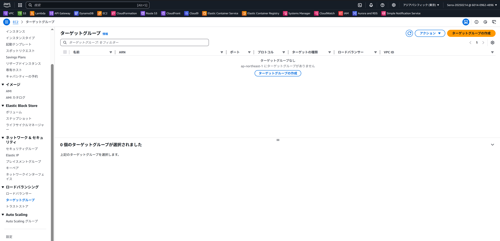

***

### 1-3. ターゲットグループの基本設定
1. ターゲットタイプの選択 から インスタンス を選択  
2. ターゲットグループ名 に target-ユーザ名 (例: target-user1) と入力  
3. IP アドレスタイプは IPv4 を選択  
4. VPC に 自分のVPC を選択 (例）hadson-user1  
5. プロトコル・ポート(HTTP:80)、プロトコルバージョン(HTTP1)はデフォルトのまま  

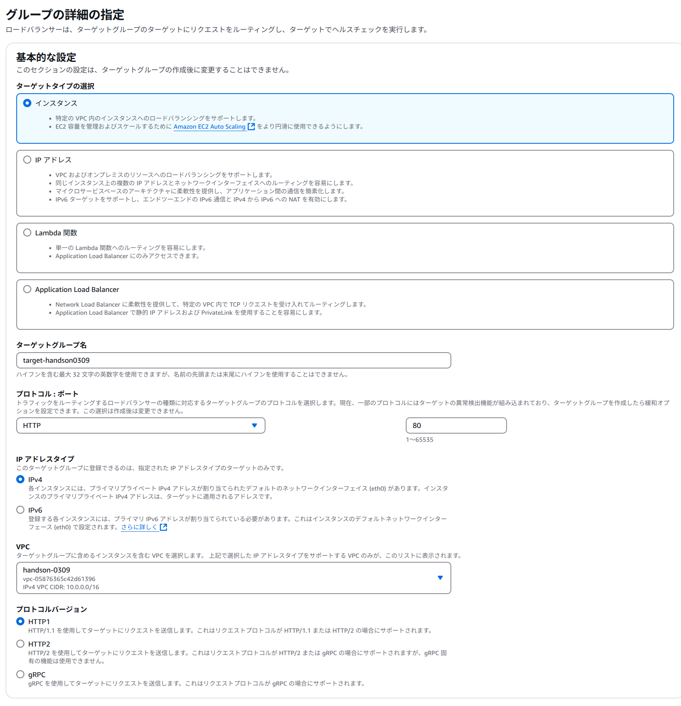

***

### 1-4. ヘルスチェックの設定  
ここでは、WordPress が HTTP ステータスコード 200 を返すように、ヘルスチェックパスを変更します。  
ヘルスチェックパス に /wp-includes/images/blank.gifをコピー&ペーストで入力  
ヘルスチェックプロトコル 、 ヘルスチェックの詳細設定、タグ はデフォルトのまま  
次へ をクリック  

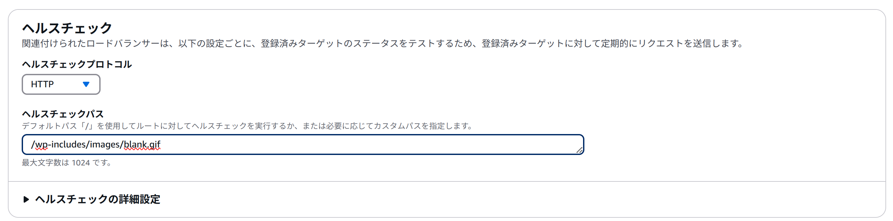

***

### 1-5. ターゲットの登録
ターゲットグループに登録する EC2 インスタンスを指定します。

作成済みの EC2 インスタンスをチェック （例: webserver#1-user1 ）
保留中として以下を含める をクリック

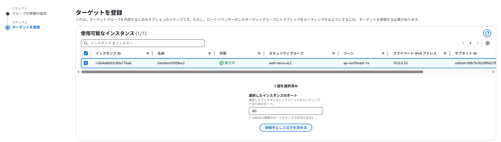

ターゲットに EC2 インスタンス(webserver#1-user1)が表示されていることを確認
ターゲットグループの作成をクリック

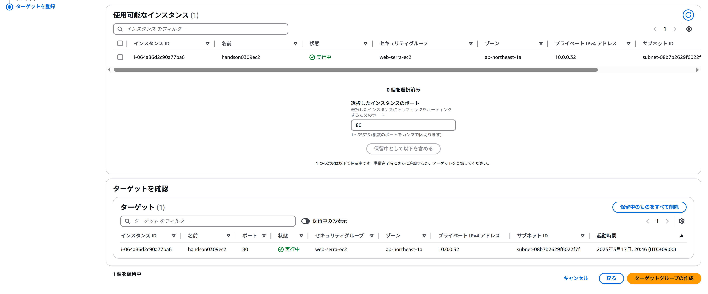

***

### 2. ターゲットグループの作成確認
下図のように targer-ユーザ名 という ターゲットグループが作成されていることを確認します。（正常に作成されましたというメッセージが表示されます）

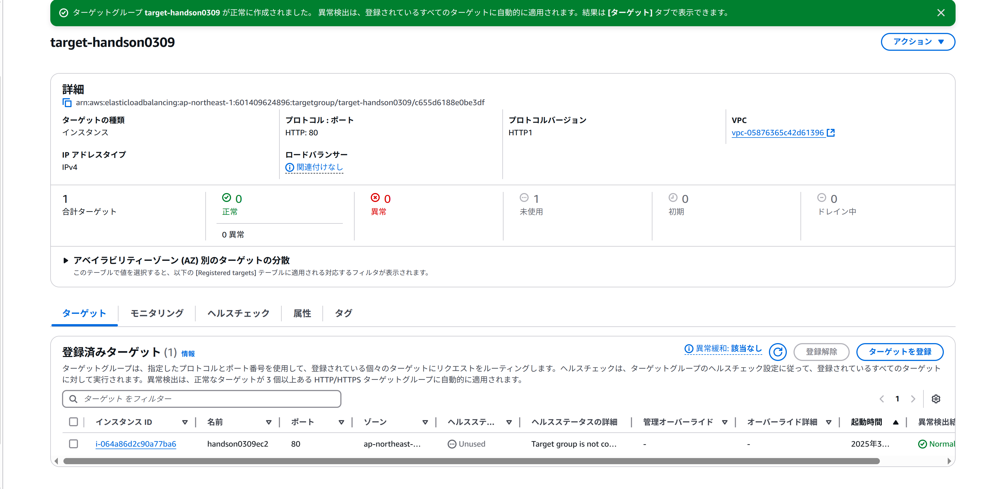

以上で、ターゲットグループが作成されました。

***

### b. セキュリティグループの作成と修正
ここで行うこと
次に、ELB 用のセキュリティグループを作成します。その後、EC2 インスタンス用のセキュリティグループを修正して、ELB から EC2 インスタンス(wordpress)にアクセスできるようにします。

***

#### 1. ELB 用セキュリティグループの作成
ここでは、自分のグローバルIPからのみ HTTP を許可するセキュリティグループを作成します

1-1. ELB 用のセキュリティグループの作成（1/2)
左側ペインから セキュリティグループ をクリック
セキュリティグループを作成をクリック

***

1-2. ELB 用のセキュリティグループの作成（2/2)
セキュリティグループ名、説明　共に elb-ユーザ名 (例: elb-user1) と入力
「VPC」で 今回作成したハンズオン用 VPC を選択 (例: handson-user1)

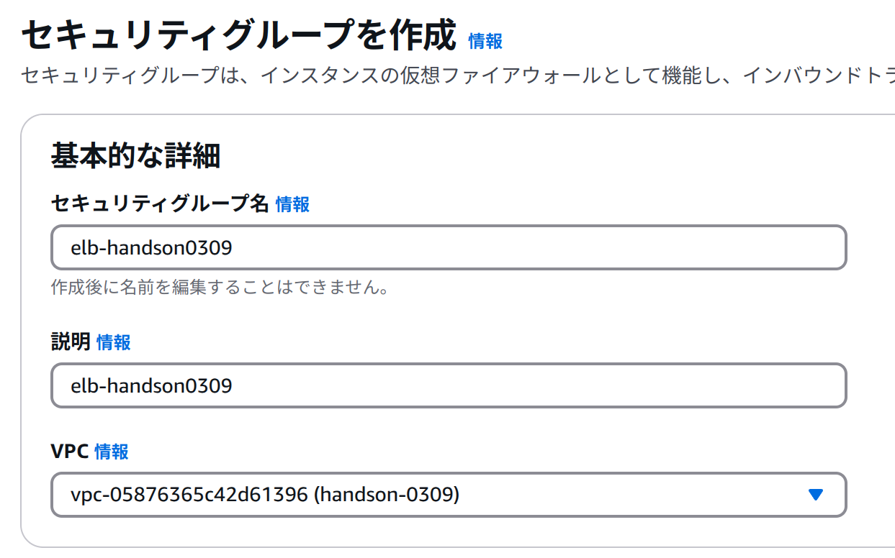

***

インバウンドルール で ルールを追加をクリック
「タイプ」を カスタム TCP から HTTP に変更
「ソース」を カスタム　から マイIP に変更して、「ソース」に 自分のグローバルIPが表示されていることを確認 (図で マスキングされている部分)

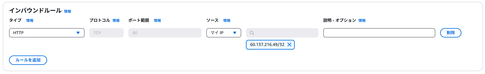

それ以外はデフォルトのままにして、セキュリティグループを作成をクリック

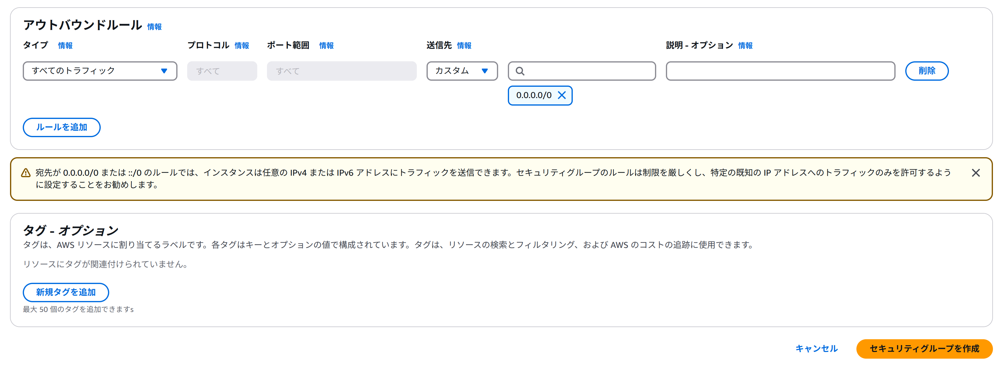

これで、ELB 用のセキュリティグループが作成されました。

ルールは、自分のPublic IP アドレスからの HTTP アクセスを許可する設定になっています。

***

#### 2. EC2 インスタンス用のセキュリティグループの修正
次に、WordPress 用のセキュリティグループ(web-user1)を修正して、ELB から EC2 インスタンスへ接続できるようにします。

2-1. セキュリティグループを確認
まず、EC2 インスタンス用のセキュリティグループ web-user1 の設定画面に移動します。

左側ペインから セキュリティグループ をクリック  
検索ボックスに web-ユーザ名 (例: web-user1) と入力  
表示されたセキュリティグループをクリック  

***
2-2. セキュリティグループを編集  
いまから、ELB から EC2 インスタンスへ接続できるように、セキュリティグループの変更を行います。  

画面中部あたりの インバウンドルールタブ をクリック  
インバウンドのルールを編集 をクリック  

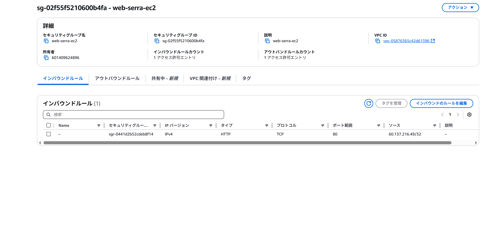

ルールの追加 をクリック  
「タイプ」を カスタム TCP から HTTP に変更  
「ソース」を カスタム 変更  
その横の検索ボックスから ELB 用セキュリティグループ elb-ユーザ名 (例: elb-user1) を選択  
ルールを保存 をクリック  

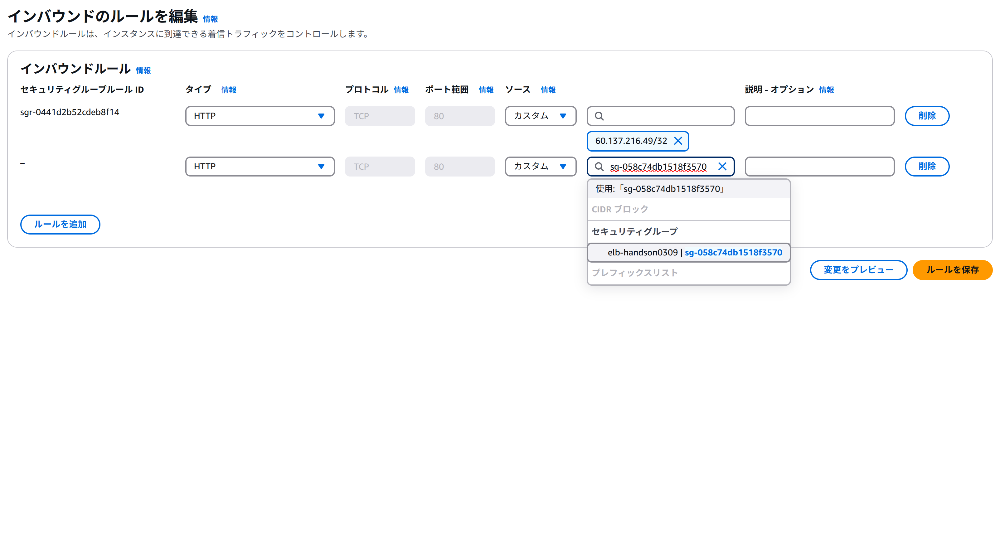

これで、WordPress用のセキュリティグループ(web-user1)が修正できました。

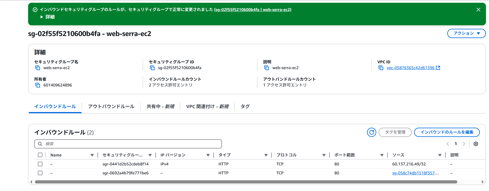

以上でセキュリティグループの設定は完了です。

***

#### c. ELB の作成
ここで行うこと
ここでは、ロードバランサー(ELB)を作成し、作成済みの EC2 インスタンス(WordPress) をロードバランサー配下に登録します。

1. ロードバランサー（ELB） の作成
ELBを作成します。既に開いている EC2 管理ページから作成します。

***

### 2-1. ロードバランサーの作成
左側のペインから ロードバランサーをクリック
ロードバランサーの作成をクリック

1. ロードバランサーの選択
本ハンズオンでは Application Load Balancer (ALB) を選択します。Application Load Balancer を選択し作成 をクリックします。

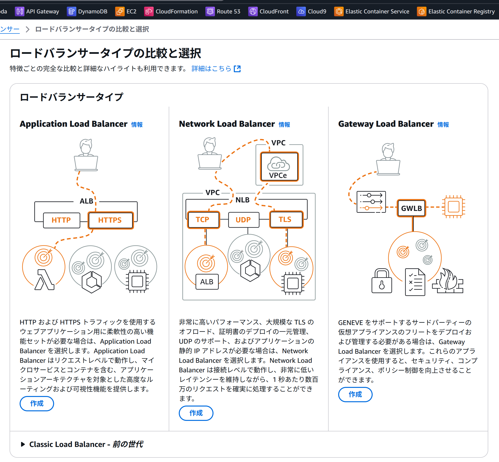

***

2. Application Load Balancer を作成
2-1. 基本設定の入力  
ロードバランサー名に elb-ユーザ名を入力 (例: elb-user1)  
スキーム、IPアドレスタイプはデフォルト値のままにします。  

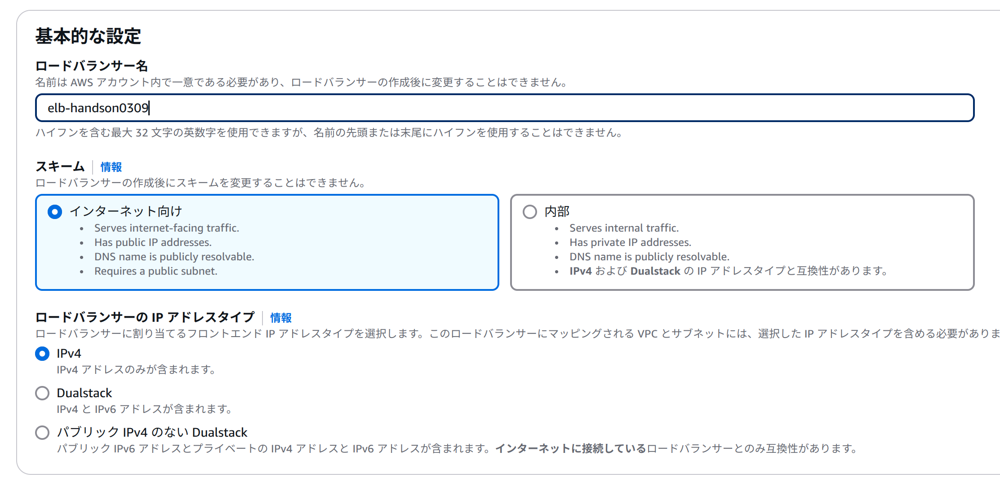

***

### 2-2. ネットワークマッピングの設定
これから作成するロードバランサーを、既に作成済みの 2つのパブリックサブネット(1aと1c) に配置します。

VPCに 自分の VPC を選択
ap-northeast-1a のチェックを入れて パブリックサブネット-1a を選択
ap-northeast-1c のチェックを入れて パブリックサブネット-1c を選択

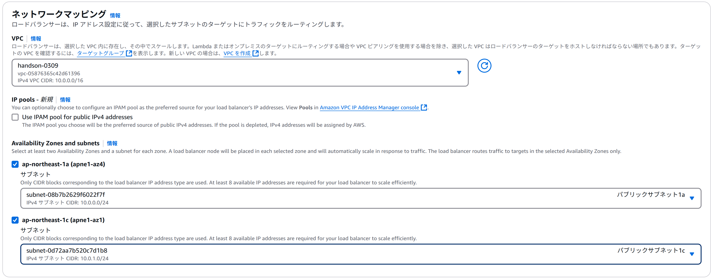

***

### 2-3. セキュリティグループの設定
ロードバランサーのセキュリティグループを設定します。ここでは、前回の手順で作成した elb-user1 を使用します

セキュリティグループ から 作成した ELB 用セキュリティグループ elb-user1 を選択（elb-ユーザ名)
default という名前のセキュリティグループが選択されている場合は、[ ✗ ] をクリックして選択を解除して、elb-user1のみが選択されているようにします。

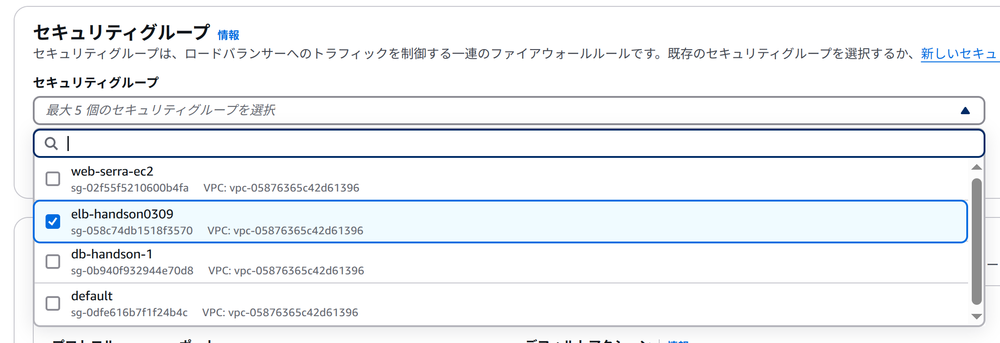

***

### 2-4. リスナーとルーティングの設定
リスナー（ELBの待ち受けプロトコルとポート）とターゲットグループの設定を行います

デフォルトアクション に さきほど作成したターゲットグループ (例) target-user1 を選択
プロトコル、ポートはデフォルトのままにします
リスナータグやロードバランサータグもデフォルトのまま(何も変更しない）にします

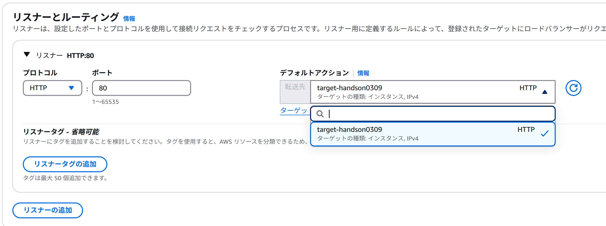

***

### 2-5. サービスの統合で最適化は デフォルトのまま
サービスの統合は 図のようにデフォルトのまま（チェックはしない）にします

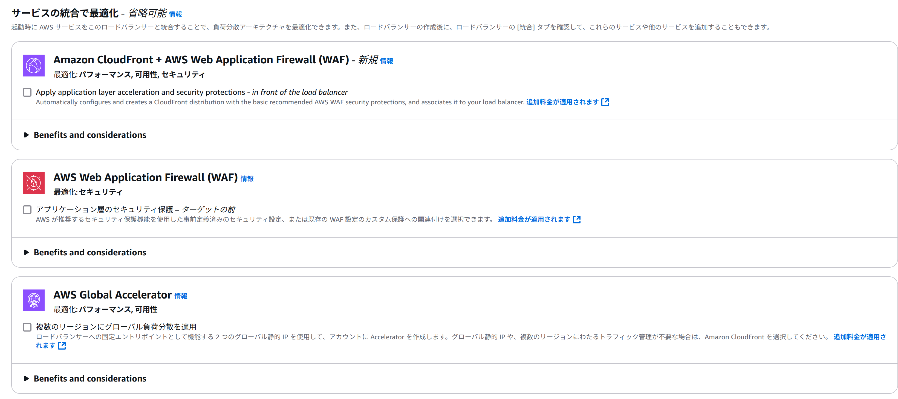

***

### 2-6. ELB の作成
設定の確認を行い、ELB を作成します。

ロードバランサー名が elb-ユーザ名になっていることを確認  
セキュリティグループが elb-ユーザ名になっていることを確認  
VPC が handson-ユーザ名になっていることを確認  
サブネットに パブリックサブネット-1a と パブリックサブネット-1c の2つが選択されていることを確認  
ターゲットグループが target-ユーザ名になっていることを確認  
以上が確認できたら ロードバランサーの作成 をクリックします  

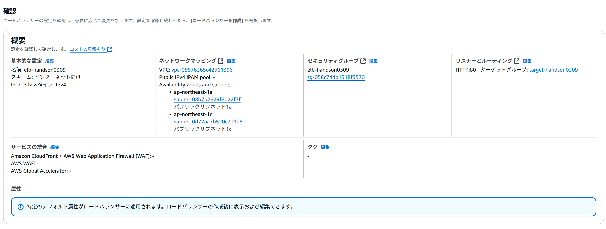

***

3. 作成した ELB の確認
画面上部にロードバランサーが正常に作成されましたと表示されればOKです。

これから、作成したロードバランサー（ELB）の詳細を確認していきます。

### 3-1. ELB の DNS 名の確認  
作成した ELB の DNS 名をメモします。  

自分の ELB が作成されている（正常に作成しましたと表示されている）ことを確認します （例: elb-user1）  
ELB の DNS 名をコピーして、忘れないようにメモ帳に保存します。elb-handson0309-1551829150.ap-northeast-1.elb.amazonaws.com (A レコード)  

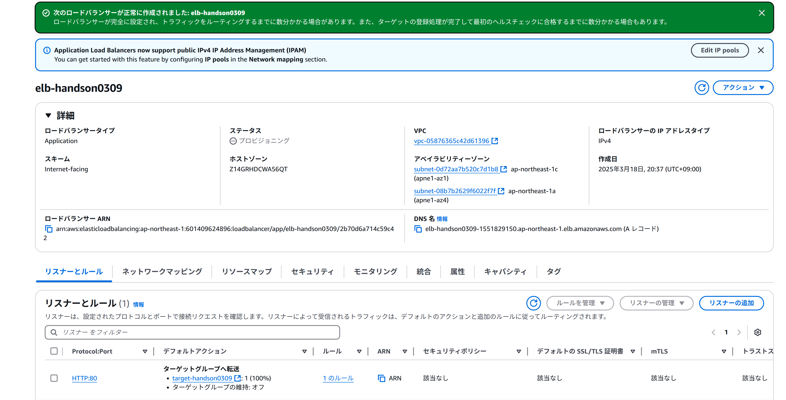

***

### 3-2. ELB 配下の EC2 インスタンスの確認
これから、ELB 配下に EC2 インスタンスが正常に登録しているか確認していきます。

リスナーとルール タブを選択します
デフォルトアクションの target-user1 (target-ユーザ名)をクリックして、ターゲットグループの詳細ページに遷移します
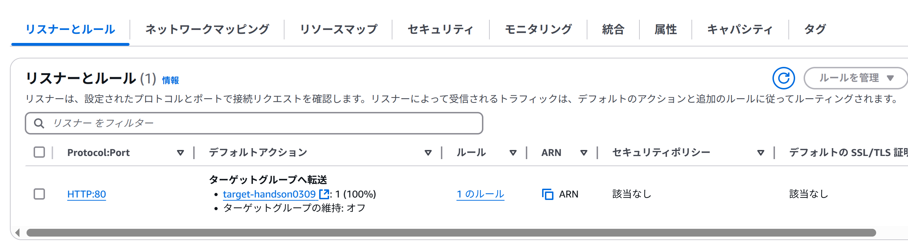

***

### 3-3. EC2 インスタンスのヘルスチェックの結果を確認
ここでは、ヘルスチェックに成功している、つまり、ロードバランサーを通じて EC2 インスタンスにアクセスできる状態になっていることを確認します。

ターゲット タブを選択
ヘルスステータスが healthy になっていることを確認します。

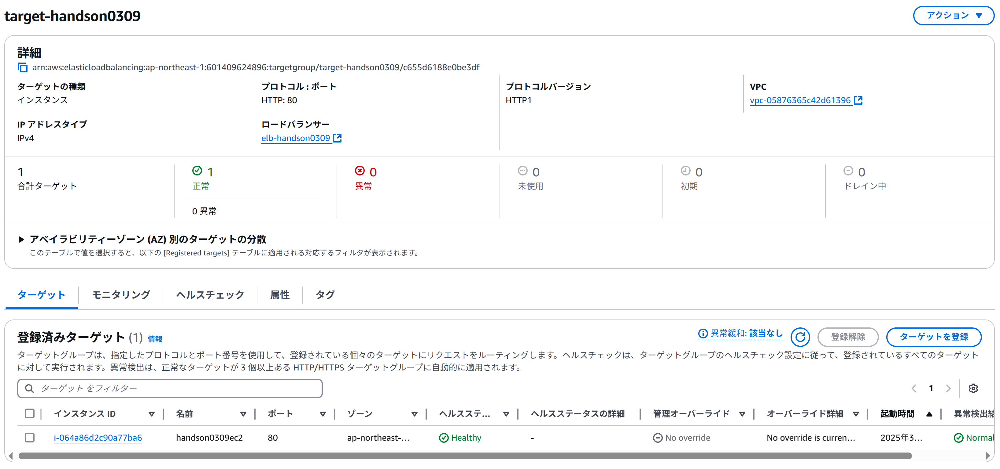

これで、作成した ELB が正常に機能していることが確認できました。

***

#### 4. 本セッションのまとめ
このセッションでは、ロードバランサー(Application Load Balancer)を作成し、作成済みの EC2 インスタンス(WordPress) をロードバランサー配下に登録しました。

***

<br><br><br><br><br><br><br><br><br><br><br><br><br><br><br><br><br><br><br><br><br><br><br><br><br><br><br><br><br><br><br><br><br><br>

# 5. WordPress の初期設定
ここで行うこと
このセッションでは、ELB(ロードバランサー) 経由で EC2 インスタンスへアクセスして、WordPress の初期設定を行います。

この段階で、EC2 インスタンス や RDS インスタンス ともに冗長構成にはなっていませんが、WordPress 自体は利用できるようになります。

***

### 1.WordPress の初期設定
1-1. ブラウザからアクセス
新しくブラウザ or タブを立ち上げます
ELB 作成時にメモした ELB の DNS 名 を立ち上げたブラウザに入力して、ELB 経由で WordPress にアクセスします
WordPress の初期設定画面が表示されるので、 さあ、始めましょう をクリックします

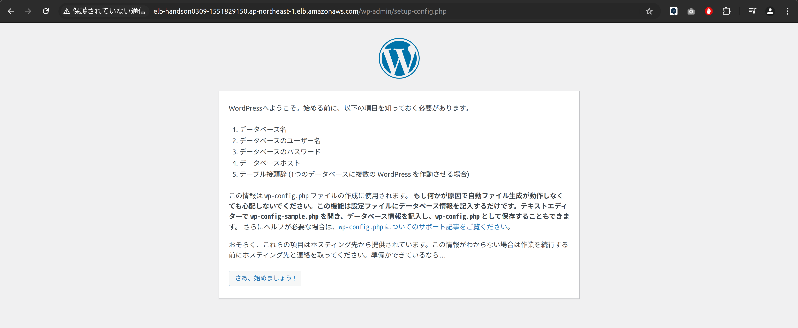

`ブラウザによっては自動的に https に変換される場合があり、http://<DNS 名>のように、DNS 名の前に http:// を明示的につけてアクセスする必要があります。
ELB の DNS 名を忘れてしまった場合は、ここに にアクセスして、自分の ELB の DNS 名を確認してください。`

***

### 1-2. WordPress の DB 設定
作成済みの RDS データベースの情報を入力して、WordPress の設定を開始します。

データベース名に wordpress (全て小文字)と入力します（！！デフォルトで入力されているように見えますが、実際は入力されていないので、必ず手動で入力してください！！）
ユーザ名に adminと入力  
作成した RDS の admin パスワードを入力 ：RDS 作成時にメモしたパスワードを使用します  
データベースのホスト名に RDS エンドポイントを入力 ：RDS 作成時にメモしたエンドポイントを使用します  
テーブル接頭辞はデフォルト(wp_)のまま  
送信をクリックします  

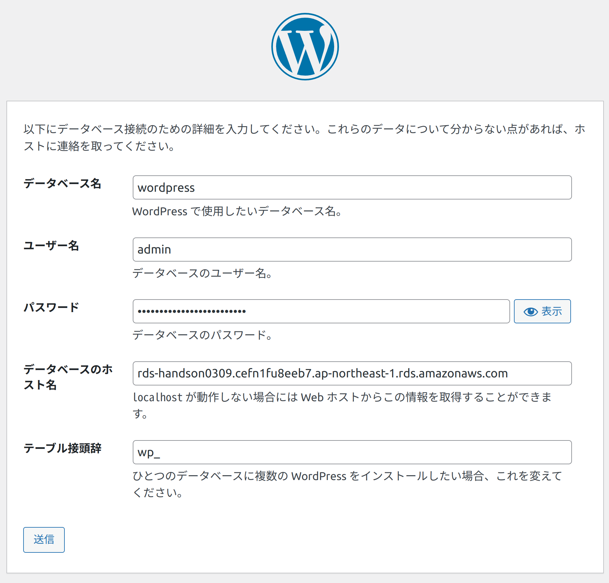

インストールの実行  
入力した情報が正しいと、インスタンス実行画面に遷移します。インストール実行をクリックします。  

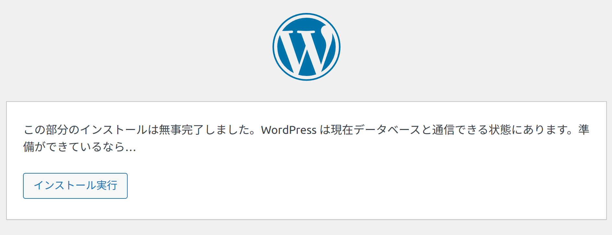

***

### 1-3. WordPress 管理情報の入力
WordPress のブログを設定します。

ブログのタイトルを入力（任意のタイトルで構いませんが、ここでは「はじめての AWS」としています）
管理者ユーザ名を入力 （ここでは admin としています）
ブログの管理者パスワードが自動的に作成されるのでこれをメモします(@pNx45!uEzqKoS0*jV)
自身のメールアドレスを入力します
検索エンジンでの表示に チェックをつけます
WordPress をインストールをクリックします

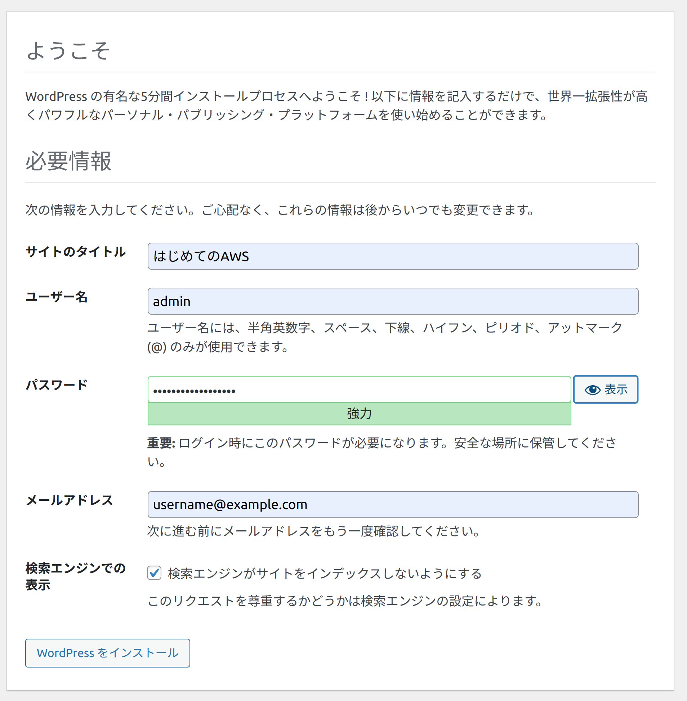

***

### 1-4. WordPress インストールの成功
成功しましたと表示されるので、ログインをクリックします。

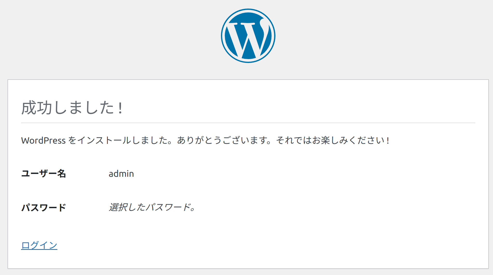

***

### 1-5. WordPress 管理画面へのログイン
ブログの管理者ユーザ名を入力 (ここでは admin としています)
メモしておいたブログの管理者パスワードを入力
ログインをクリック

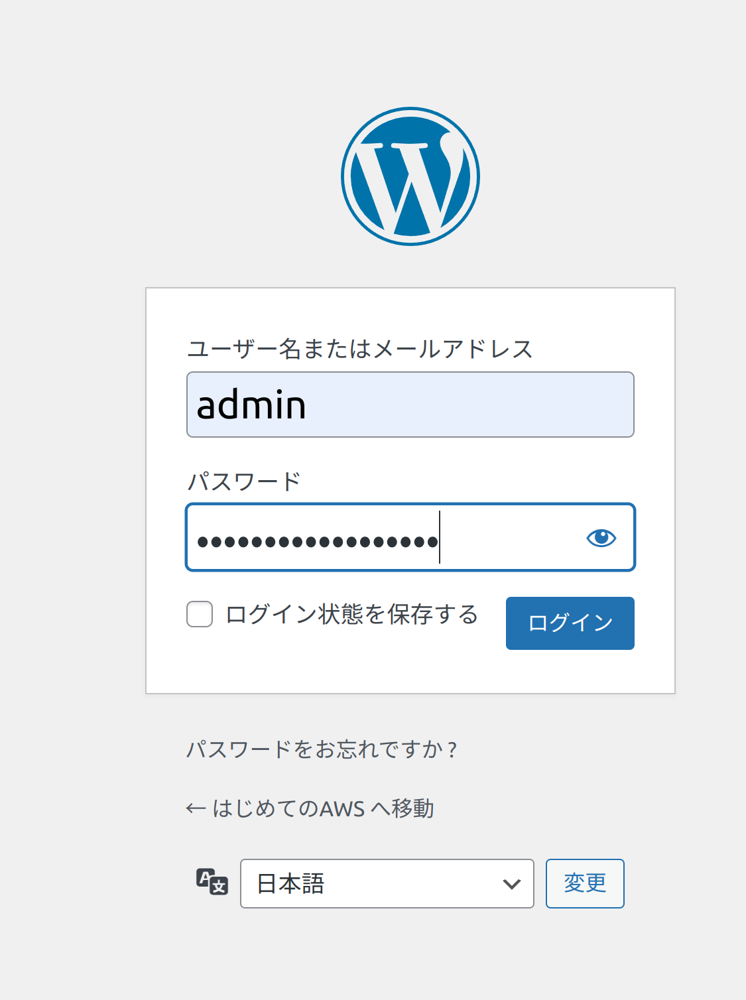

***

### 1-6. 管理画面の表示
WordPress の管理者画面が表示されます。

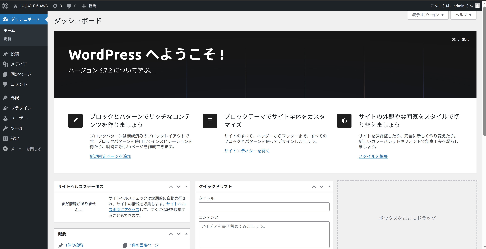

***


### 1-7. ブログの表示
WordPress 管理画面からブログが表示されることを確認します。

ブログ名(はじめての AWS) から サイトを表示をクリック

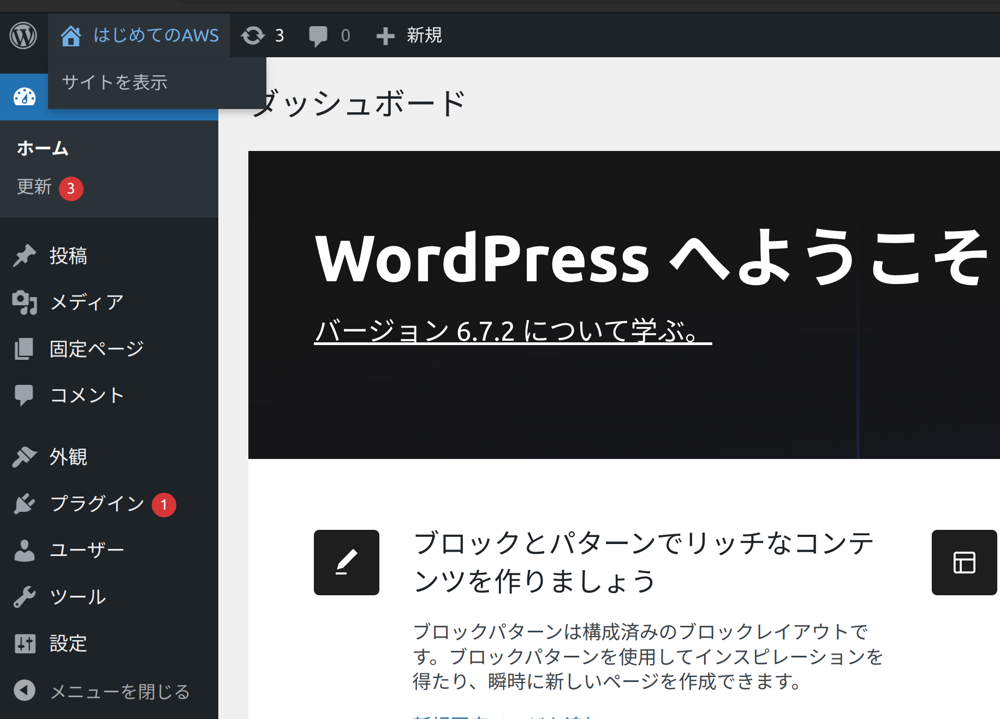

***

ブログが表示されることを確認（表示される管理画面やブログは、WordPressのバージョンによって異なる場合があります）

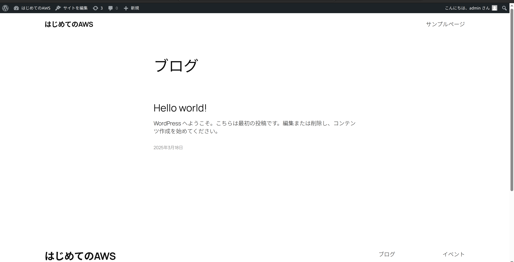

***

(オプション）2. EC2 インスタンス上のアクセスログを確認
本ハンズオンでは、WordPress 等は自動でインストールされるため、 EC2 インスタンス自体に アクセスする必要はありません。

ここでは、オプションとして、EC2 インスタンスにアクセスして、アクセスログを確認してみましょう。

ログインする OS の選択
Amazon Linux か Windows Server へ接続するかで、手順が分かれていますので、接続したい OS を以下のタブから選択してください。

***

### 2-1. EC2 インスタンスへアクセス
こちら から EC2 インスタンス一覧ページにアクセス
アクセスしたいインスタンスを選択 (例：webserver#1-user1)
接続 をクリック

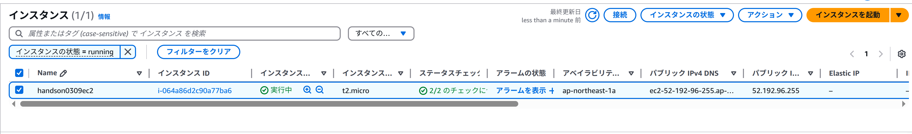

***

セッションマネージャー タブをクリック
接続 をクリック

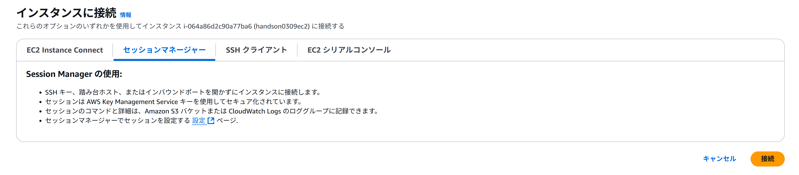

別ブラウザ or タブが立ち上がり、ブラウザ越しで EC2 インスタンスにアクセスできます

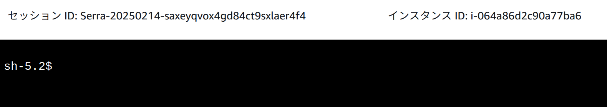

***

### 2-2. アクセスログの確認
以下のコマンドを、EC2 インスタンス上で実行します。 すると、ELB の定期的なヘルスチェックが実行されたり、WordPress でページをリロードするたびに EC2 インスタンスへのアクセスが発生していることを確認できます。

```
sudo tail -f /var/log/httpd/access_log
```

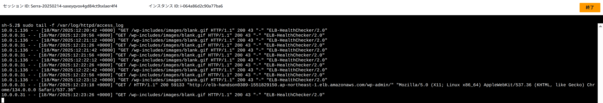

確認後は、もう EC2 インスタンス内部での作業は行いませんので、ブラウザ or タブは、閉じていただいても大丈夫です。

***

### 4. 本セッションのまとめ
このセッションでは、作成した ELB(ロードバランサー) 経由で EC2 インスタンスへアクセスして、WordPress の初期設定を行いました。 オプションとして、EC2 インスタンスへアクセスし、アクセスログの確認を行いました。

***

<br><br><br><br><br><br><br><br><br><br><br><br><br><br><br><br><br><br><br><br><br><br><br><br><br><br><br><br><br><br><br><br><br><br><br><br><br><br>

# 6. AMI の作成
ここで行うこと
本セッションでは、作成した EC2 インスタンスから Amazon Machine Image (AMI) を取得し、 EC2 インスタンスを複製する準備を行います。


1. EC2 管理ページを開く
検索ボックスでec2を入力し、表示されたEC2をクリック

2. WordPress の AMI の作成
### 2-1. AMI (イメージ)の作成(1/3)
作成済みの webserver#1-ユーザ名 (例： webserver#1-user1) を元に AMI を作成します。

この AMI には WordPress や RDS への接続情報が含まれており、この AMI をもとに 2 つ目の EC2 インスタンスを作成します。

左側のペインから インスタンス をクリック
websever#1-ユーザ名の EC2 インスタンスを見つけて、チェックを入れる　例) webserver#1-user1
右上の アクション –> イメージとテンプレート -> イメージを作成をクリックする

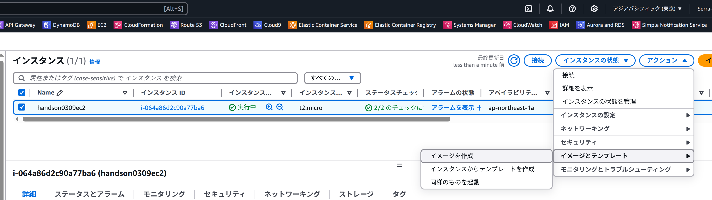

### 2-2. AMI (イメージ)の作成(2/3)
イメージ名に wordpress-ユーザ名 と入力　（例) wordpress-user1

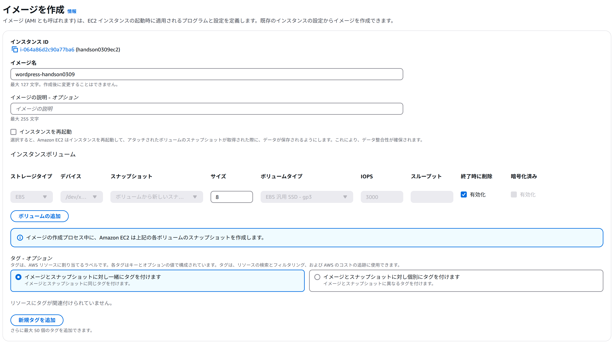

***

新規タグを追加をクリックして「キー」に Name、「値」にwordpress-ユーザ名と入力（例) wordpress-user1
その他の項目はデフォルトのまま イメージを作成をクリック

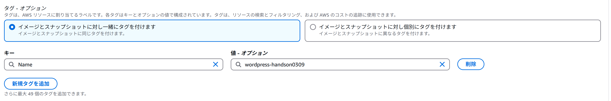

***

### 2-3. AMI (イメージ)の作成(3/3)
左側のペインから AMI をクリックし、AMI 一覧を表示します
作成した AMI 名(例： wordpress-user1) のステータス が 保留中 になっていること確認します

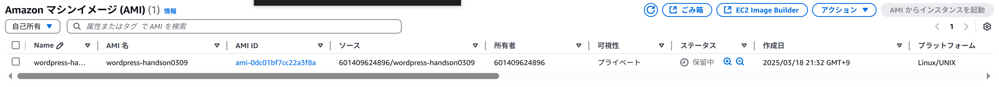

AMI の作成が完了する（下図のように ステータスが 利用可能 になる) まで、数分待ちます

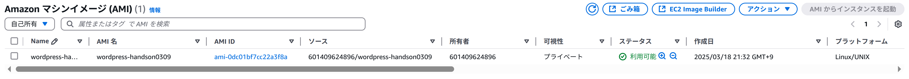

利用可能になれば、作成済みの EC2 インスタンスのイメージ(AMI) が作成完了です！

***

3. 本セッションのまとめ
本セッションでは、作成した EC2 インスタンスから Amazon マシーンイメージ (AMI) を取得しました。
次は、作成した AMI を使って、2 つ目の EC2 インスタンスの作成を行います。

***
<br><br><br><br><br><br><br><br><br><br><br><br><br><br><br><br><br><br><br><br><br><br><br><br><br><br><br><br><br><br><br><br><br><br><br><br><br><br>

# 7. 2 つ目の EC2 インスタンスの作成
ここで行うこと
本セッションでは、さきほど作成した AMI を利用して、2 つ目の EC2 インスタンスを作成します。

WordPress のインストールや設定は既に完了済みの AMI を利用しているため、WordPress などのインストール作業は不要です。

***

### 1. 2つ目の EC2 インスタンスの作成
1-1. AMI からの EC2 インスタンスの起動
さきほど作成した AMI から EC2 インスタンスを作成します。

こちら から AMI 一覧を表示
作成した AMI を見つけ、チェックボックスにチェックをいれる (例: wordpress-user1 )
AMI からインスタンスを起動をクリック

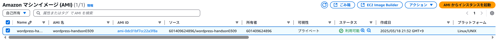

***

### 2. 2つ目の EC2 インスタンスの情報を入力
2-1. EC2 インスタンスの名前
名前に webserver#2-ユーザ名 (例: webserver#2-user1 )と入力します。2つ目の EC2 インスタンスのため webserver#2 としています

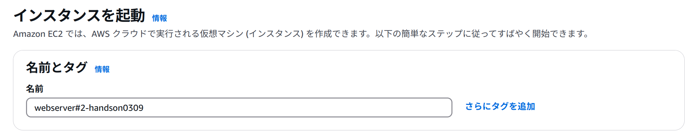

***

### 2-2. AMI と インスタンスタイプ(デフォルトのまま)
AMI とインスタンスタイプは、どちらもデフォルトのままにします
OS イメージ: 「カタログからの AMI」- 「wordpress-user1」が選択されている
インスタンスタイプ: t2.micro が選択されている

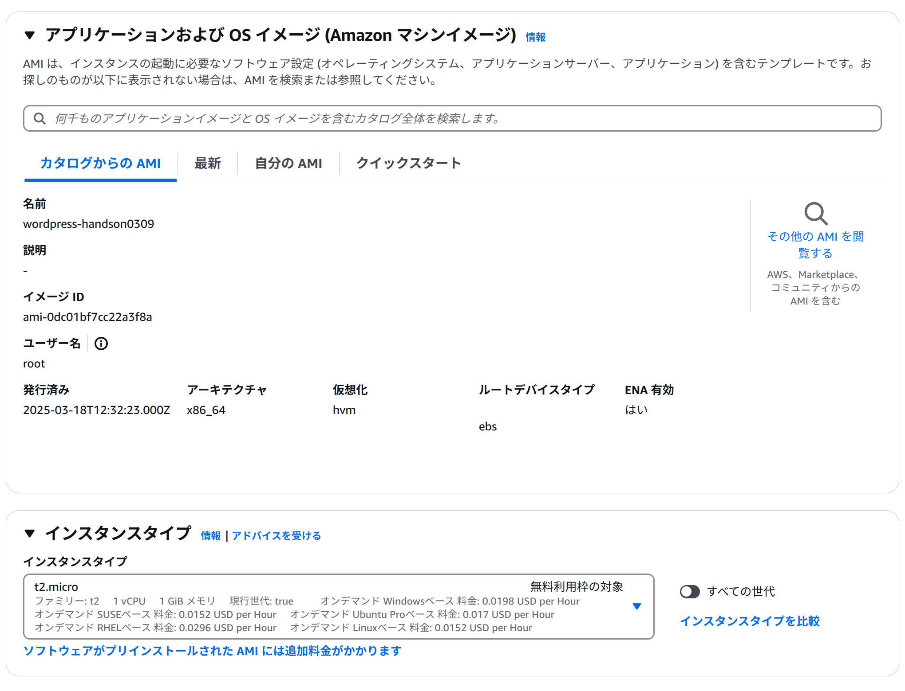

***

### 2-3. キーペアの設定
本ハンズオンでは、SSHキーペア(SSHでのログイン)は使用しないので、「キーペア名」に キーペアなしで続行 を選択します

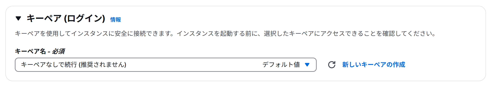

***

### 2-5. ネットワーク設定(VPC・サブネットの指定)
「VPC」で 今回作成したハンズオン用 VPC を選択 (例: handson-user1)
「サブネット」で パブリックサブネット-1c を選択
「パブリック IP の自動割り当て」で 有効化 を選択

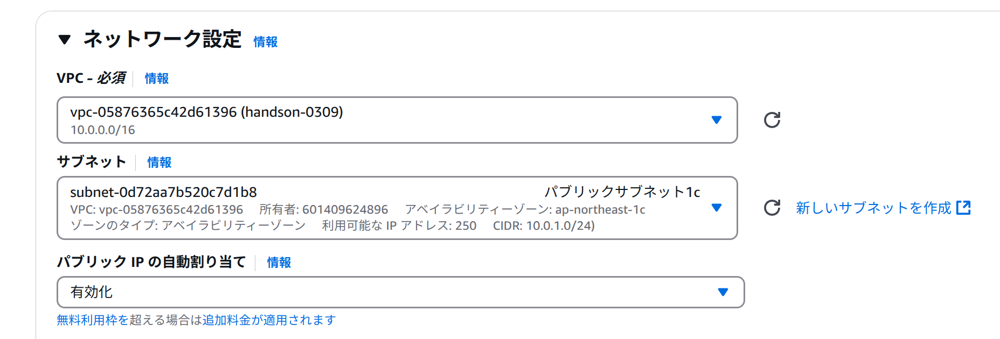

***

### 2-6. ネットワーク設定(セキュリティグループの指定)
「ファイアーウォール(セキュリティグループ)」で 既存のセキュリティグループを選択する を選択
「共通のセキュリティグループ」から web-user1 を選択

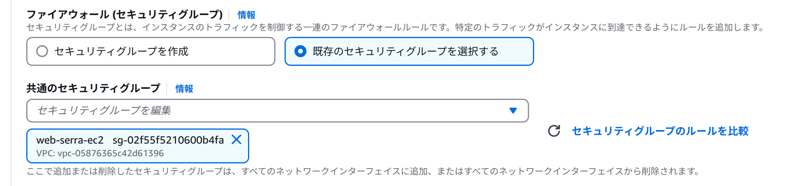

***

### 2-7. EC2 インスタンスの起動
前手順までに設定した項目以外は全てデフォルトのままにします。
「概要」から インスタンスを起動 をクリックして、インスタンスを起動します

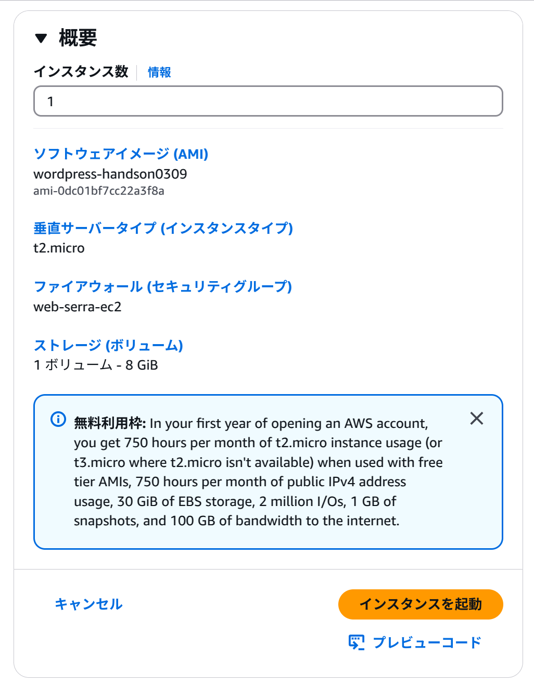

***

### 2-8. インスタンスの作成ステータス
作成した EC2 インスタンスの詳細を確認していきます。すべてのインスタンスを表示をクリックし、作成したインスタンスの詳細を確認します

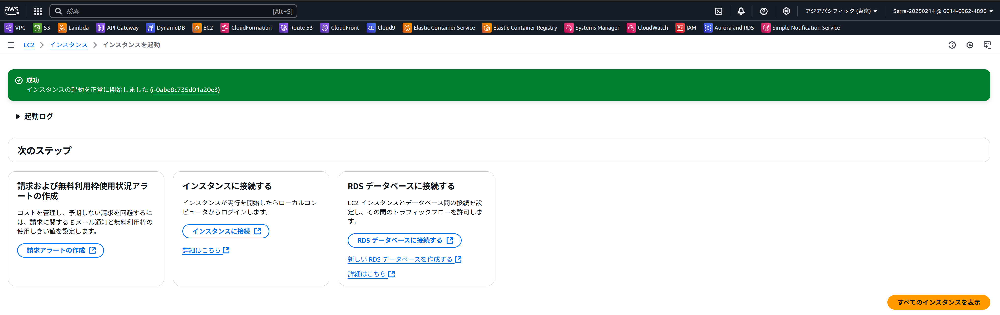

***

3. 作成した EC2 インスタンスを確認
作成したインスタンスが表示(図の場合 webserver#2-user1)されるので、チェックボックスにチェックを入れます。

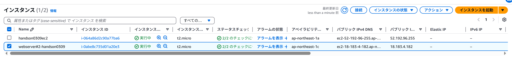

***

画面下の詳細タブをクリックし、赤枠内の値がスクリーンショットの通りになっていることを確認します。  
パブリック IPv4 アドレスが割り当てられていること  
インスタンスタイプが t2.micro になっていること  
VPC ID が、今回作成した VPC になっていること  
サブネット IDが、パブリックサブネット-1c になっていること  

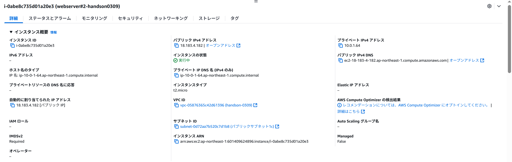

***

以上で、2つの EC2 インスタンスの作成が完了です！

3. 本セッションのまとめ
本セッションでは、AMI を利用して、2 つ目の EC2 インスタンスを作成しました。

1 つ目の EC2 インスタンスを元に作成したため、WordPress はすでにインストールされています。

***
<br><br><br><br><br><br><br><br><br><br><br><br><br><br><br><br><br><br><br><br><br><br><br><br><br><br><br><br><br><br><br><br><br><br><br><br><br><br>

# 8. 2 つ目の EC2 インスタンスを ELB に登録
ここでやること
前セッションで作成した 2 つ目の EC2 インスタンスを ELB に登録します。 この時点で、ELB には 2つの EC2 インスタンスが登録されているため、Webレイヤー(EC2 インスタンス) は負荷分散かつ冗長構成になっています。

***

1. EC2 管理ページを開く
検索ボックスでec2を入力し、表示されたEC2をクリック

***

2. 2 つ目の EC2 インスタンスを ELB へ登録
### 2-1. ターゲットグループの選択  
左側のペインからターゲットグループを選択  
作成したターゲットグループ target-ユーザ名 (例: target-user1)をクリック  
クリックして、ターゲットグループの詳細ページに遷移します  

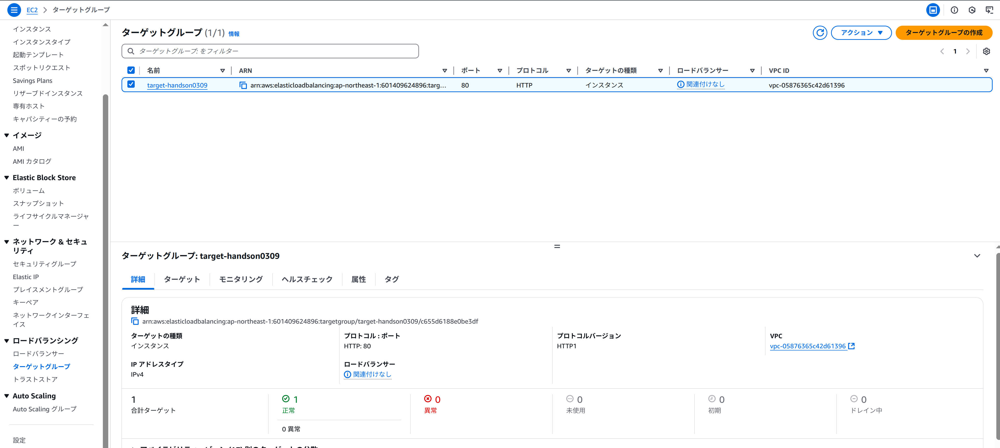

***

### 2-2. 登録済みターゲットの表示  
ターゲットタブをクリックすると、1 つ目の EC2 インスタンス webserver#1-user1 が登録されていることが確認できます  
ターゲットを登録をクリックし、2 つ目の EC2 インスタンスを登録していきます  

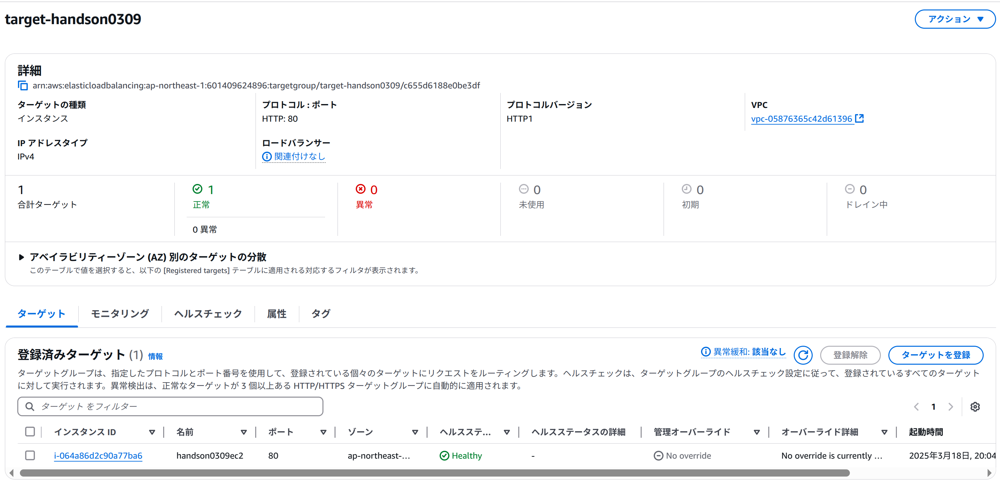

***

### 2-3 ターゲットの登録
さきほど作成した 2つ目の EC2 インスタンスをチェック （例: webserver#2-user1 ）
保留中として以下を含めるをクリック  

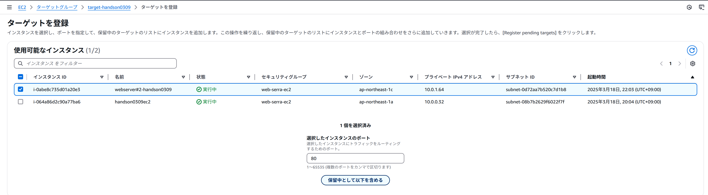

ターゲットに 2 つ目の EC2 インスタンス（webserver#2-user1）が表示されていることを確認
確認できたら、保留中のターゲットの登録をクリック

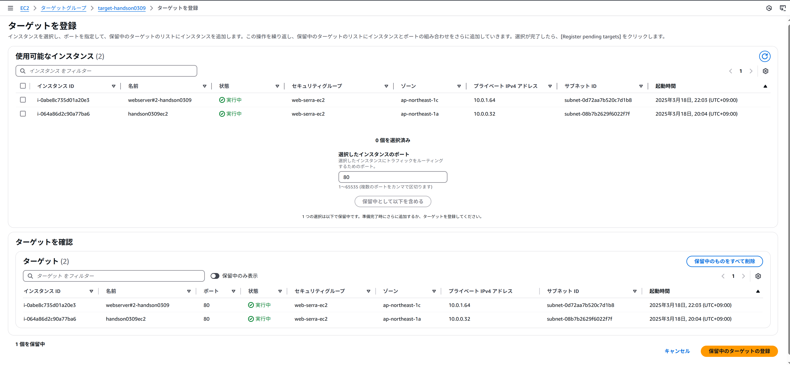

### 2-4 ヘルスチェックの確認
追加した EC2 インスタンスのヘルスステータスが initial から healthy に変わるまで待ちます（約 30 秒かかります)

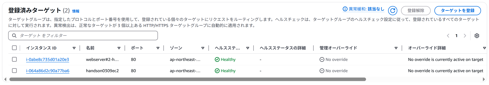

***

healthy に変わると、2 つ目の EC2 インスタンスが ELB に正常に登録されています。

3. 本セッションのまとめ
このセッションでは 2 つ目の EC2 インスタンスを ELB に登録しました。

ELB には EC2 インスタンスが 2 つ登録されており、負荷分散かつ冗長構成となっています。

***
<br><br><br><br><br><br><br><br><br><br><br><br><br><br><br><br><br><br><br><br><br><br><br><br><br><br><br><br><br><br><br><br><br><br><br><br><br><br>

# 9. RDS インスタンスのマルチ AZ 配置化
ここで行うこと
本セッションでは、RDS インスタンスをシングル AZ から マルチ AZ 配置に変更し、DB レイヤーについても、可用性を高める構成にします。

***

手順
1. Amazon RDS の管理ページに移動します
まず、画面上部の検索ボックスに rds と入力し、表示された RDS をクリックして、Amazon RDS の管理ページに移動します。

2. マルチ AZ への変換
左側の データベース をクリックして表示される rds-user1 の横にある ◯ にチェックを入れる
画面右上の アクション -> マルチ AZ 配置への変換 を順にクリック

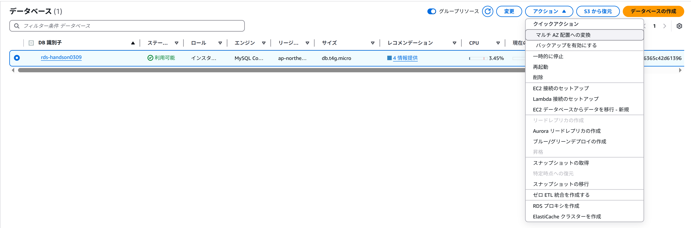

いつマルチ AZ 配置への変更を行うか聞かれるので、すぐに適用 を選択
マルチ AZ に変換 をクリック

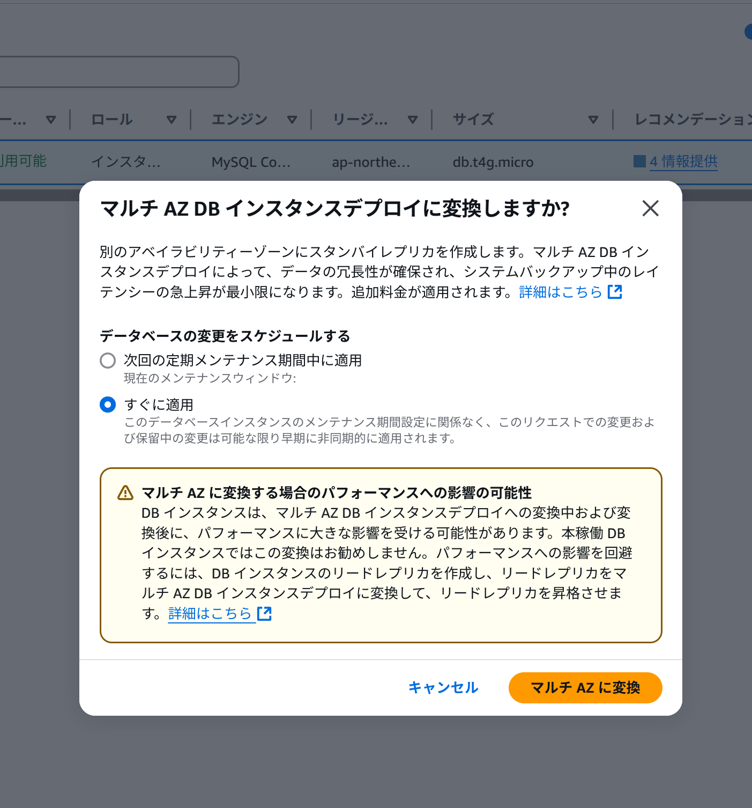

マルチ AZ 配置が完了するまで 5分程度かかるため、ステータスが 利用可能 になるまで待ちます。

ステータスが 利用可能 になれば、マルチ AZ 配置が完了しています。

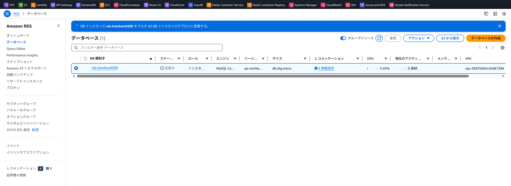

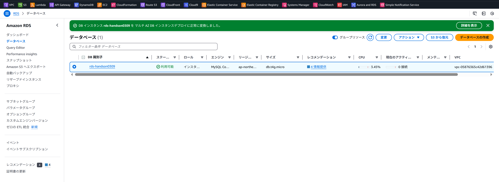

画面のように、表示された項目を右にスクロールすると、マルチAZ : あり になっていることを確認できます。

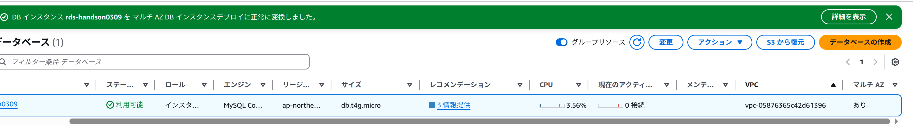

***

3. 本セッションのまとめ
本セッションでは、シングル AZ 配置で作成した RDS DB インスタンスを マルチ AZ 配置へ変更しました。  
以上で、本ハンズオンの構成は完成ですが、次に、EC2 インスタンス(Web レイヤー) と RDS インスタンス (DB レイヤー) の可用性について、それぞれ確認していきます。  

<br><br><br><br><br><br><br><br><br><br><br><br><br><br><br><br><br><br><br><br><br><br><br><br><br><br><br><br><br><br><br><br><br><br><br><br><br><br>
# 10. 可用性の検証
ここでは、作成した構成をもとに、以下の可用性の検証を行います。

a. EC2 インスタンスを1つ停止させ、全体の可用性の確認  
b. RDS インスタンスのフェイルオーバーを行い、全体の可用性を確認  

***

### a. EC2 インスタンスを1つ停止させ、全体の可用性の確認
ここで行うこと
本セッションでは、意図的に EC2 インスタンスを1つ停止させ、その状態でも、WordPress のブログが問題なく見れることを確認します。

***

1.EC2 管理ページを開く
検索ボックスでec2を入力し、表示されたEC2をクリック

***

2. EC2 インスタンスの停止
### 2-1. 1 つ目の EC2 インスタンスの停止
左側のペインから インスタンス をクリック
webserver#1-ユーザ名 インスタンスをチェック （例: webserver#1-user1)
画面右上の インスタンスの状態 -> インスタンスを停止をクリック

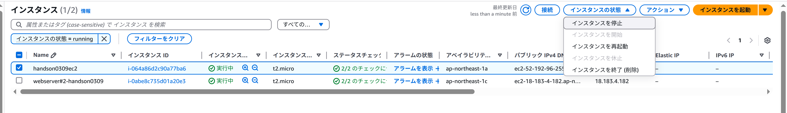

***

### 2-2. EC2 インスタンスの停止を実行
停止をクリック

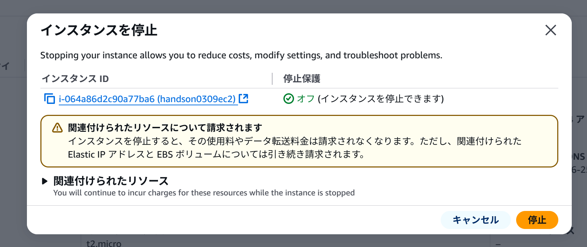

***

### 2-3. EC2 インスタンスの停止を確認
インスタンスの状態 が 実行中 から 停止済み に変わるまで待ち(1 ~ 2 分)、次の手順に進みます

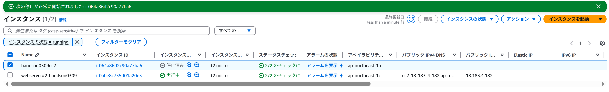

***

#### 3. ELB から見た EC2 インスタンスの状態を確認
### 3-1. ターゲットグループを確認
左側のペインから ターゲットグループ を選択
作成したターゲットグループをクリックし (例: target-user1)、詳細ページへ遷移します

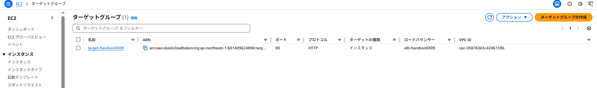

***

### 3-2. EC2 インスタンスの状態を確認
ターゲット タブをクリック
停止したインスタンスが unused になっていること、つまり、ELB から外れていることを確認します

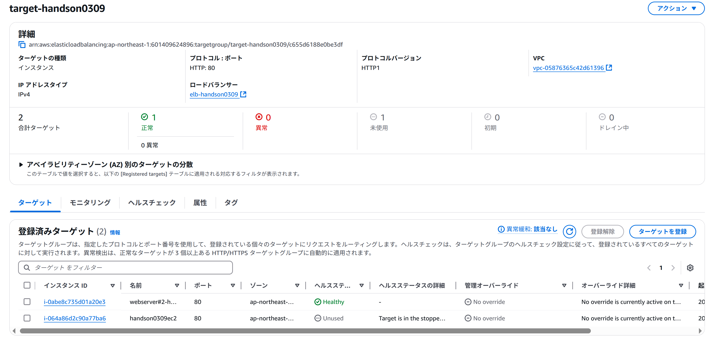

***

### 4.ブログが問題なく表示されることを確認
メモしておいた ELB の DNS名 を別ブラウザ or 別タブに入力します。
EC2 インスタンスが 1 つ停止した状態でも、ブログが問題なく表示されることを確認します。

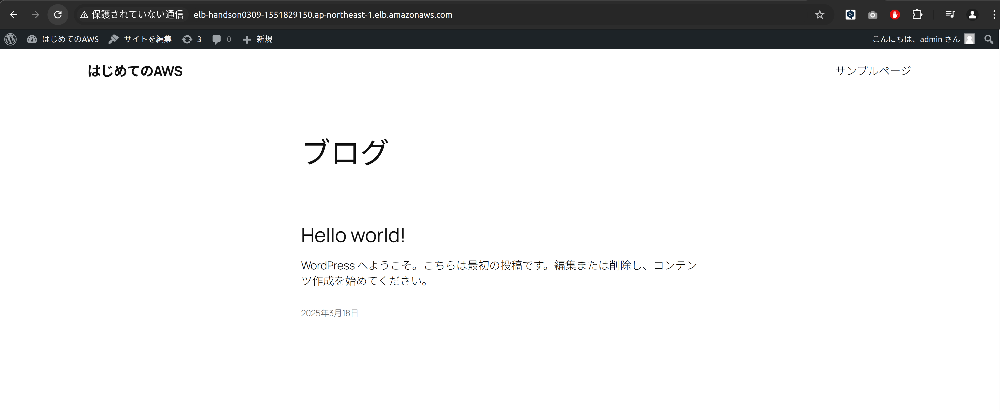

***

これで、EC2 インスタンスが 1 つ停止した状態でも、ブログが問題なく表示されることが確認できました！
それでは、停止した EC2 インスタンスを再度起動して、元の状態に戻していきます。  

***

### 5. 停止している EC2 インスタンスを起動し、元の状態に戻す  
左側のペインから インスタンスをクリック  
停止している webserver#1-ユーザ名 インスタンスをチェック (例: webserver#1-user1 )  
画面右上の インスタンスの状態 -> インスタンスを開始をクリック  

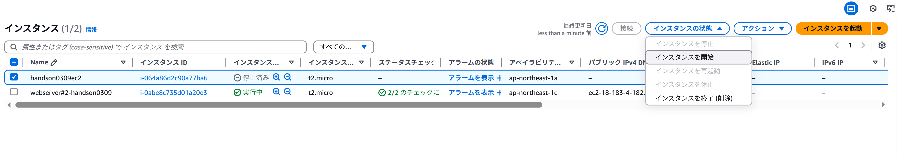

***

インスタンスの状態が 停止済み から 実行中 に変わるまで待ち(約 1 分)、次の手順に進みます

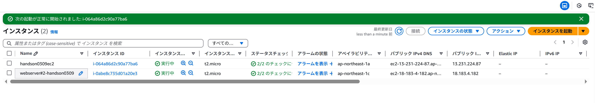

***

### 6. ELB から見た EC2 インスタンスの状態を確認
### -1. ターゲットグループを確認
左側のペインから ターゲットグループ を選択
作成したターゲットグループをクリックし (例: target-user1)、詳細ページへ遷移します

***

### 6-2. EC2 インスタンスの状態を確認
ターゲット タブを選択します
起動したインスタンスが initial から healthy になることを確認します（確認したタイミングによっては、すでに healthy になっている場合もあります）
これで、EC2 インスタンスが元の状態に戻ったことが確認できました

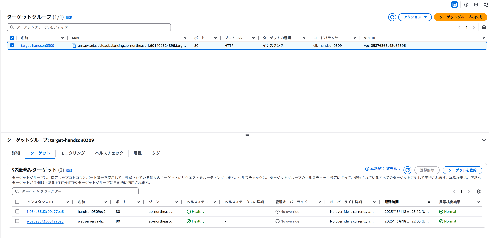

***

### 7. 本セッションのまとめ
本セッションでは、意図的に EC2 インスタンスを1つ停止させ、その状態でも、ブログが問題なく見れることを確認しました。

***

### b. RDS インスタンスのフェイルオーバーを行い、全体の可用性を確認
ここで行うこと
本セッションでは、RDS インスタンスのフェイルオーバーを手動で行います。 フェイルオーバーの動作の確認、そして、フェイルオーバー後も WordPress ブログが問題なく見れることを確認します

***

手順
1. RDS 管理ページを開く
検索ボックスで rds と入力し、表示される RDS をクリック

***

2. RDS インスタンスをフェイルオーバーさせる
### 2-1. フェイルオーバーさせる RDS インスタンス を選択
左側のペインから データベース をクリック
自分のインスタンス(例: rds-user1) を選択
アクション - 再起動 をクリック

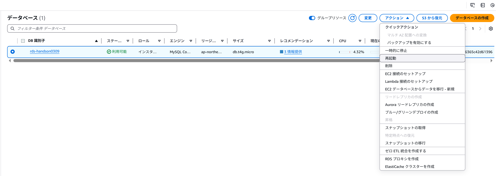

***

### 2-2. フェイルオーバーの実行
フェイルオーバーで再起動しますか にチェックを入れる
確認 をクリック

`
フェイルオーバーのチェックが入っていないと、フェイルオーバーしないまま再起動（DBの停止）が発生するため、ご注意ください
`

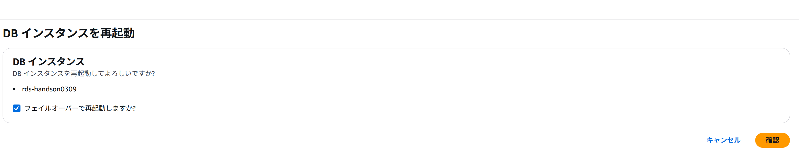

***

### 2-3. フェイルオーバーの確認 & ブログの確認
ステータスが 再起動中 (フェイルオーバー中) になっていることを確認します（利用可能 になればフェイルオーバー完了です）

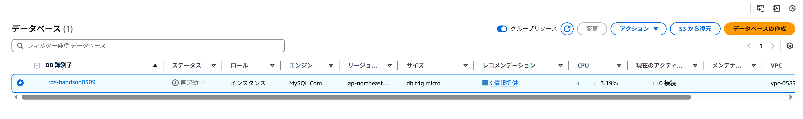

***

フェイルオーバー中にブログにアクセスして、ブログが見れるか確認します。

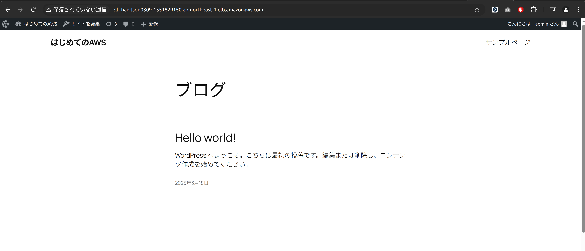

***

`
-フェイルオーバー時間は通常 60～120 秒です。
`

`
-フェイルオーバー中は、RDS に接続できないため、ブログにアクセスしても応答がない場合があります。その場合は何度かブラウザ or タブの再読み込みを行ってください。
`

`
-Amazon RDS のフェイルオーバーの詳細についてはこちら から確認いただけます。
`

`
-ステータスが 再起動中 のままから変化がない場合は、リロードボタンをクリックして、リロードを行ってください。
`

***

ステータスが 利用可能(フェイルオーバー完了) に変わるまでまちます。
フェイルオーバー後にブログに再度アクセスして、ブログが問題なく見れることを確認します。


***

3. RDS イベントの確認
ここでは、RDS イベントを確認して、実際にフェイルオーバーが発生したことを確認します。

### 3-1. RDS DB インスタンスの詳細を確認
DB インスタンスの詳細を確認するため、DB識別子の rds-user1 (rds-ユーザ名) をクリックします。

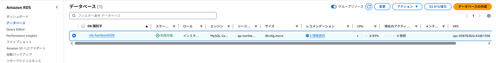

***

### 3-2. RDS イベントを確認
ログとイベント タブをクリック
最近のイベント から フェイルオーバーのイベント が実際に発生したことを確認します
例えば Multi-AZ instance failover completed がフェイルオーバーが完了したイベントログです

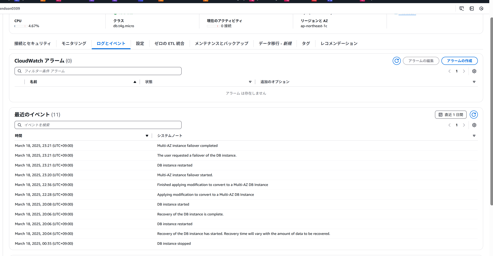

***

4. 本セッションのまとめ
本セッションでは、RDS インスタンスのフェイルオーバーを手動で行い、フェイルオーバー後も、ブログが問題なく見れることを確認しました。

***

11. 次のステップ  
おめでとうございます！これでメインハンズオンは終了です！

***


