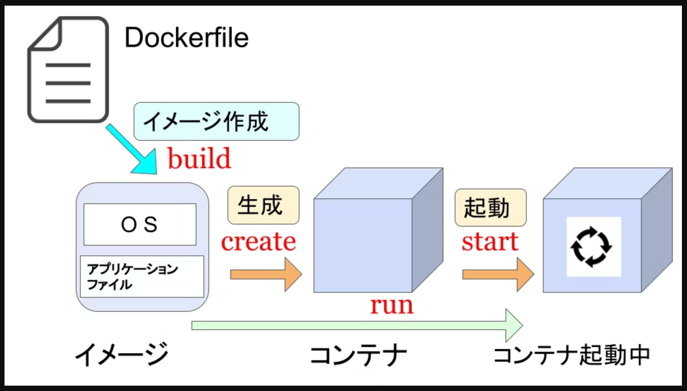

dockerファイルの作成
docker buildコマンドの実行

docker build コマンドを実行することで、Dockerfile で設定した内容を基に、コンテナイメージを作成
-t : 作成するコンテナイメージに指定したタグを付与。hello-world というわかりやすいタグを指定
docker build -t hello-world .

作成されたことを確認するために、DockerImage の一覧を確認
docker images


docker buildとは、Dockerイメージを作成するコマンドです。このコマンドを使って、指定したコンテキスト（例えば、ファイルやディレクトリ）からDockerイメージを構築することができます。
基本的な使用方法:

bash
docker build [OPTIONS] PATH
主なポイント:
PATH:

Dockerfileやそのコンテキストを含むディレクトリへのパスを指定します。

通常、Dockerfileに記載された指示に基づいてイメージが作成されます。

OPTIONS:

-tオプションを使用してイメージに名前とタグをつけることができます。

bash
docker build -t myimage:latest .
この例では、現在のディレクトリ（.）にあるDockerfileを基にmyimage:latestという名前のイメージが作成されます。


# Dockerfileの書き方について

Dockerfileは、**イメージを構築するための指示（例：ベースイメージ、コピーするファイル、インストールするパッケージなど）が書かれたファイルです。**

docker buildを実行すると、Docker EngineがDockerfileを解析し、指定された内容に従ってイメージを作成します。

キャッシュ:

docker buildは過去のビルドのキャッシュを利用することで、ビルドプロセスを効率化します。

キャッシュを無効にする場合は、--no-cacheオプションを使用します。

bash
docker build --no-cache -t myimage:latest .
Dockerイメージはコンテナとして実行される基本となるものなので、効率的なビルドが重要です。

aws ecr get-login-password | docker login --username AWS --password-stdin 601409624896.dkr.ecr.ap-northeast-1.amazonaws.com
601409624896.dkr.ecr.ap-northeast-1.amazonaws.com/h4b-ecs-helloworld

docker push 601409624896.dkr.ecr.ap-northeast-1.amazonaws.com:0.0.1


docker push 601409624896.dkr.ecr.ap-northeast-1.amazonaws.com/h4b-ecs-helloworld:0.0.1


項目	設定値
コンテナイメージ	OS やアプリケーションのファイルを含むファイルシステムのようなもので、コンテナのテンプレートとなる。
コンテナ	コンテナイメージを元に起動されるアプリケーションプロセス。
イメージレジストリ	コンテナイメージを保管および提供するサービスで、リポジトリにコンテナイメージを格納する。
Dockerfile	コンテナイメージの作成手順をコードとして記述したファイル。

systemctlは、Linuxのsystemdシステムおよびサービスマネージャを操作するためのコマンドです。主にサービスの管理や起動プロセス、システムの状態確認などに使用されます。以下は基本的な使い方の概要です：
systemctl は、Linux のシステムで使用されるコマンドラインツールで、systemd のシステムおよびサービスマネージャを制御するために使われます。
systemd は、現代の多くの Linux ディストリビューションで使用されるシステムおよびサービスマネージャです。
systemctl を使うことで、システムのサービスやデーモンの状態を確認したり、管理したりすることができます。


# Dockerfileの書き方

Dockerfileとは、**Dockerイメージを作成するためのテキストファイルです。**  

Dockerfile内には、**基本となるOS、インストールする必要があるソフトウェア、コピーするファイル・ディレクトリ、開くポート、実行するコマンド**など、新しいDockerイメージを作成するために必要な指示が含まれています。  
Dockerfileの書き方としては、**「FROM」,「RUN」,「CMD」**などのインストラクションに引数を記述し、作成します。  



###  (1)FROM
「FROM」インストラクションはDockerfileの中で**一番最初に記述されるべき命令**で、**新たに作成するDockerイメージのベースとなるイメージ**を指定します。    
また、ベースイメージはDockerHubを参考にします。  
「FROM」インストラクションの後には**イメージ名とタグ**を指定します。  
イメージ名はそのイメージが何を表しているのか（例えば、Ubuntu,Node.js,Rubyなど）を示し、タグはそのイメージのバージョンを表します。 
```
FROM：インストラクション
# 書式：　FROM [イメージ] [タグ]
$ FROM　ubuntu:22.10
``` 

###  (2)RUN
「RUN」インストラクションは**Dockerイメージのビルド時にシェルコマンドを実行するための命令**です。  
この命令を使用することで、**イメージにソフトウェアをインストールしたり、セットアップの手順を実行したりすること**ができます。  
「RUN」インストラクションは実行ごとに新しいレイヤを作成してその上でコマンドを実行するため、多くの「RUN」を持つDockerfileは多くのレイヤから成るイメージを作成し、イメージのサイズが大きくなります。しかし、レイヤ数が多いと、PCの容量が圧迫されたり、イメージのビルドに時間がかかったりするため、レイヤ数は最小限にすることが望ましいです。  
このため、複数のコマンドを一度にまとめて実行するときは「&&」で繋ぎ、「RUN」を減らし、複数行になるときは「\」（バックスラッシュ）で繋げることにより見やすくしましょう。  
```
# 書式：　RUN [コマンド] 
$ RUN apt update \
    && apt install -y apache2
```
###  (3)CMD
「CMD」インストラクションは、**Dockerコンテナが実行されたときにデフォルトで実行するコマンドを定義**します。  
CMDの指定方法にはexec形式とshell形式の２種類あり、基本的にはexec形式を使います。  
[]で囲み、一つずつパラメータをダブルクオーテーションで囲むことに注意しましょう。  

```
# 書式：　CMD ["実行ファイル", "パラメータ1","パラメータ2"] 
$ CMD ["apachectl","-D","FOREGROUND"]
```

```
RUNとCMDの違いとは？
インストラクションで受け取る引数にあるコマンドを実行する点では似ている「RUN」と「CMD」ですが、大きな違いは「RUNはレイヤを作る」、「CMDはレイヤを作らない」ことです。  
レイヤは再生可能であり、Dockerは一度ビルドされたレイヤをキャッシュして再利用することができるため、ソフトウェアのインストールやファイルのコピーなどイメージの構築に必要な手順を  「RUN」で指示することによりベースイメージにキャッシュさせ覚えさせることで、何度もダウンロードせず済みます。  
```
###  (4)COPY
「COPY」インストラクションは、**ホスト（ローカル）のファイルやディレクトリをDockerイメージにコピー**します。  
具体的な使い方としては、ソースコードや設定ファイルはローカルで作成して、COPYを使ってDockerイメージにコピーして使用します。  
```
# 書式：　COPY [コピー元][コピー先] 
①ファイルをファイルに
$ COPY　index.html /mydir/index.html 
②ファイルをディレクトリ以下に
$ COPY　index.html　/mydir/ 
③ディレクトリをディレクトリに            
$ COPY src/ /mydir/
```
###  (5)ENV
「ENV」インストラクションは、<span style="color: green; ">Dockerfile内で環境変数を設定するため</span>に使用されます。  
設定された環境変数は、その後のDockerfileの中で使用することができ、また生成されたDockerイメージから作成される全てのコンテナで利用可能です  
```
# 書式：　ENV [キー]　＝　[値] 
$ ENV MYSQL_USER=admin
$ ENV MYSQL_PASSWORD=password
```
###  (6)WORKDIR
「WORKDIR」インストラクションは、コマンドを実行する作業ディレクトリを指定します。  
「WORKDIR」インストラクションを使用することで、Dockerfileが読みやすくなり、絶対パスを何度も書く手間が省くこともできるので、適切に使っていきましょう。

```
# 書式：　WORKDIR [ディレクトリのパス] 
$ WORKDIR /app
```

これは<span style="color: red; ">赤文字</span>です