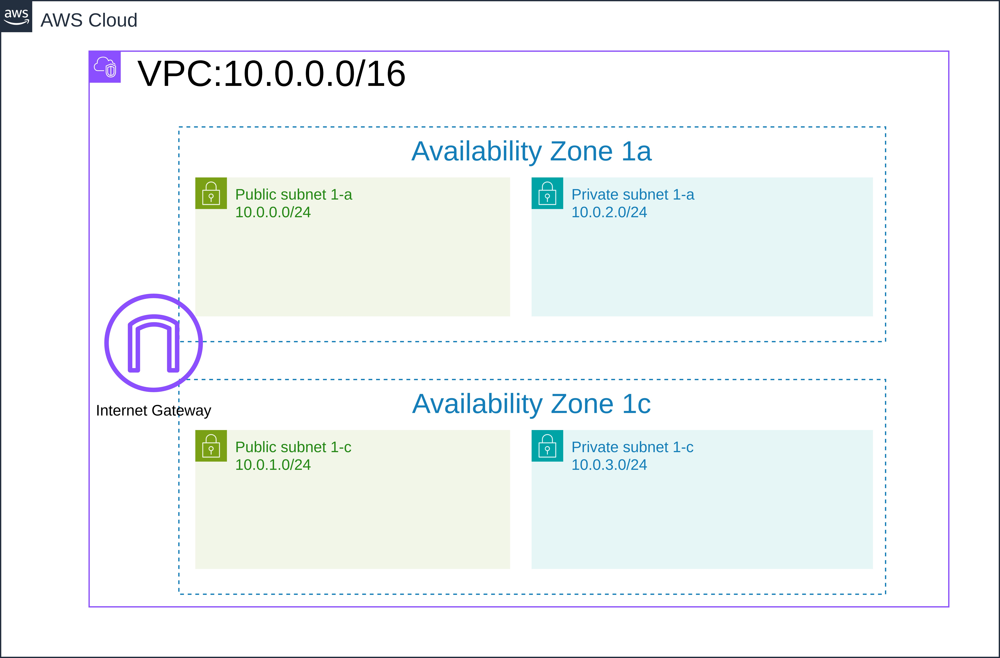
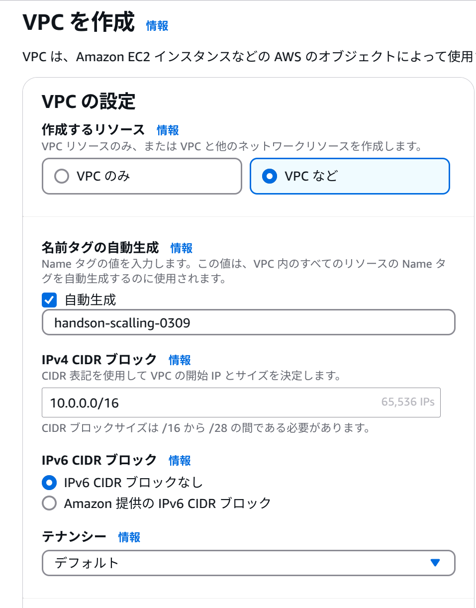
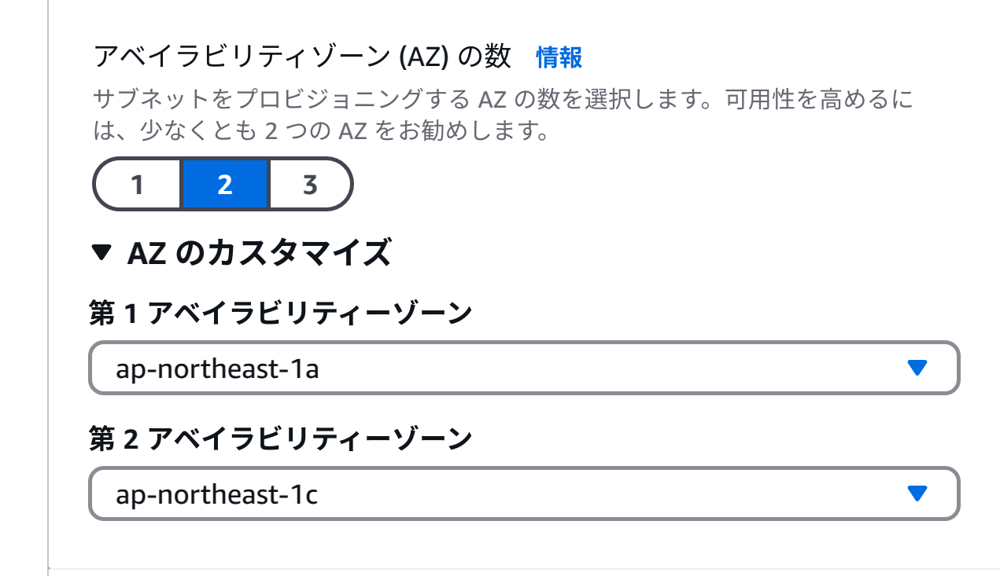
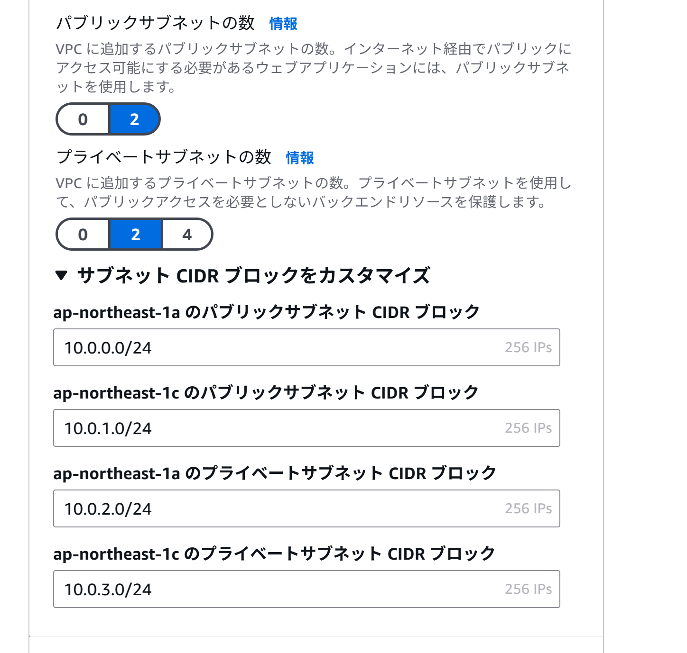
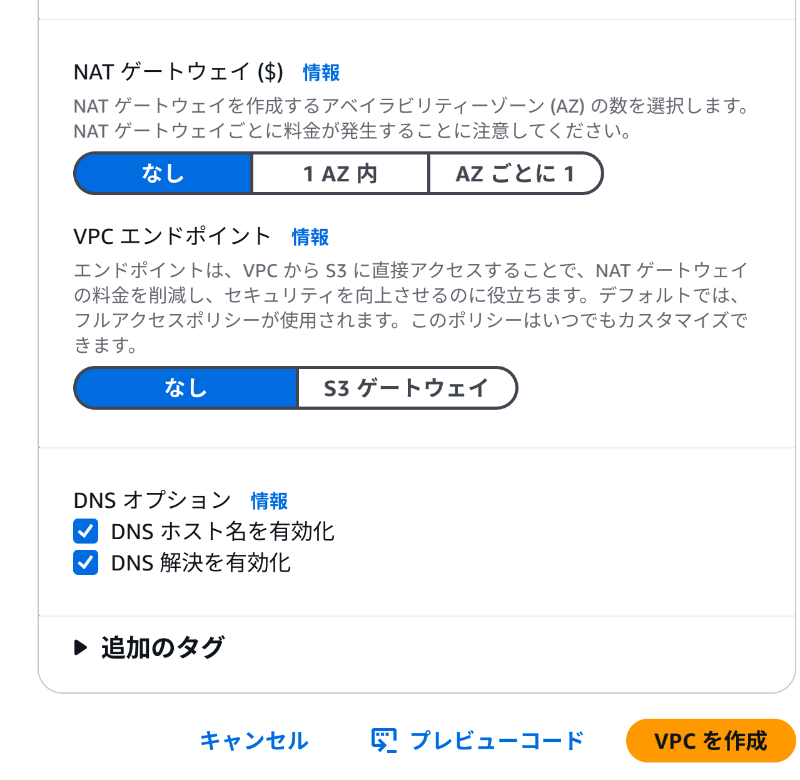
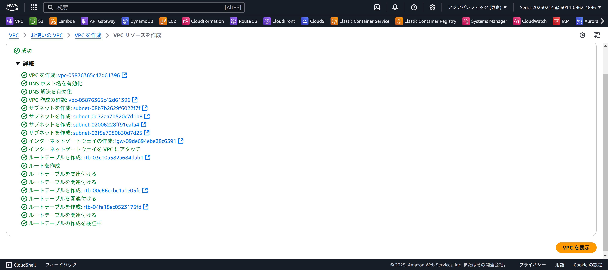

# スケーラブルサイト構築

## **1. VPCの構築**
 

**今回構成するVPCの完成図**

   

**1. VPC作成ウィザードでのVPC作成**
 

1. 作成するリソース→VPCなど
2. 名前タグの自動生成→任意の名前を入力
3. IPv4 CIDRブロック→デフォルトのまま(10.0.0.0/16)
4. IPv6 CIDRブロック→IPv6 CIDRブロックなし
5. テナンシー→デフォルト

6. AZの数→2
7. AZのカスタマイズ- 第1アベイラビリティゾーンが「ap-northeast-1a」、  第2アベイラビリティゾーンが「ap-northeast-1c」になっていることを確認。  

8. パブリックサブネットの数→2
9. プライベートサブネットの数→2
10. **サブネットCIDRブロックをカスタマイズ** 10-1. ap-northeast-1aのパブリックサブネット→10.0.0.0/24   
10-2. ap-northeast-1cのパブリックサブネット→10.0.1.0/24   
10-3. ap-northeast-1aのプライベートサブネット→10.0.2.0/24   
10-4. ap-northeast-1cのプライベートサブネット→10.0.3.0/24  

11. NATゲートウェイ→なし
12. VPCエンドポイント→なし
13. DNSオプション→両方ともチェックが入ったままにしておく
14. VPCを作成ボタンを押下

