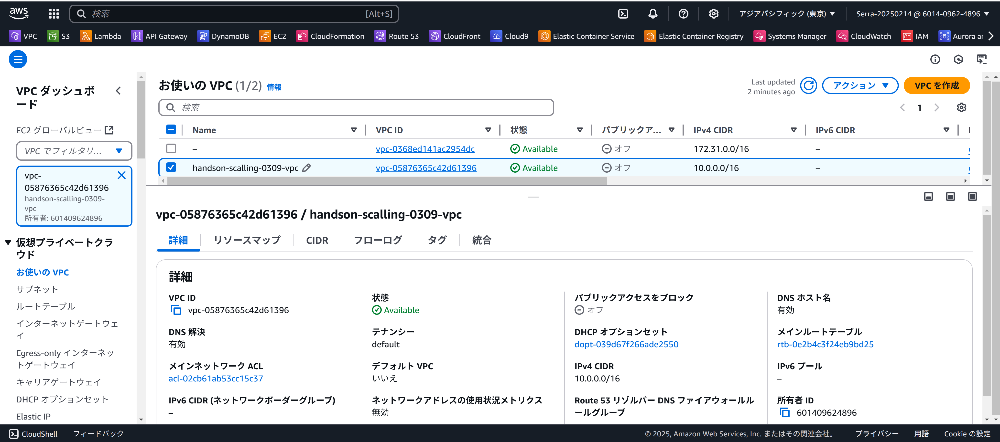
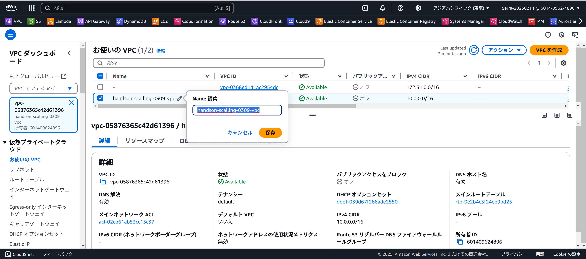
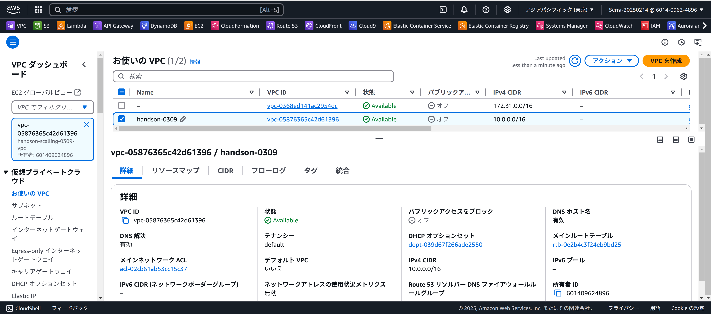
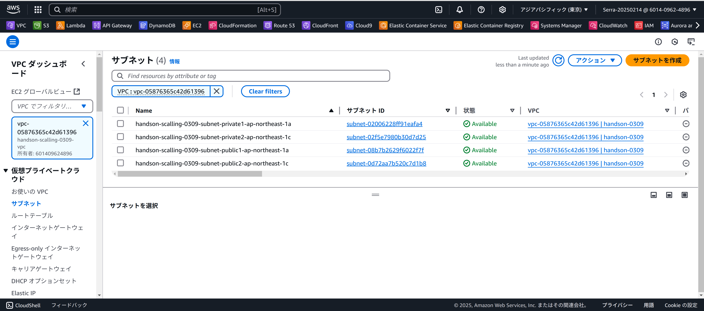
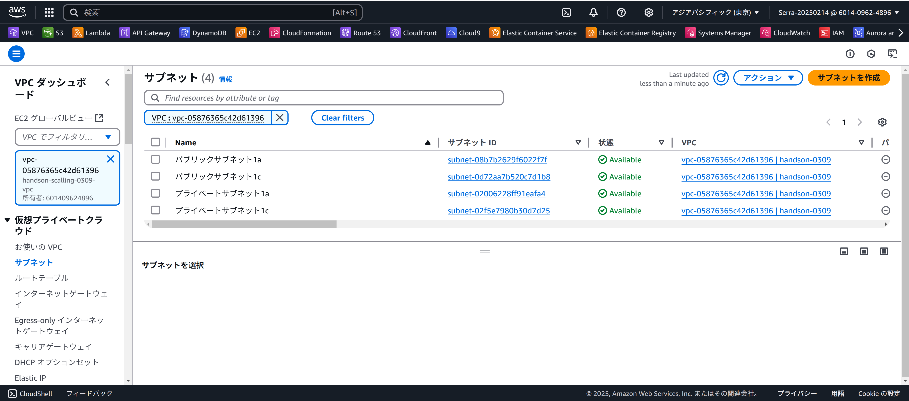
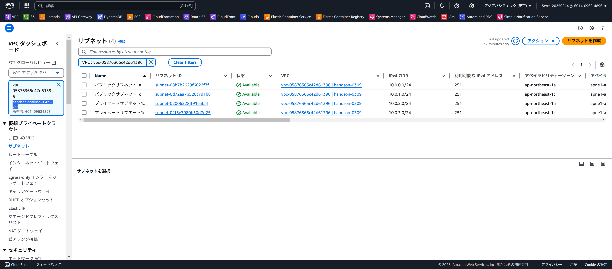

# スケーラブルサイト構築

## **1. VPCの構築**
 

**今回構成するVPCの完成図**

   

## **1. VPC作成ウィザードでのVPC作成**
 

1. 作成するリソース→VPCなど
2. 名前タグの自動生成→任意の名前を入力
3. IPv4 CIDRブロック→デフォルトのまま(10.0.0.0/16)
4. IPv6 CIDRブロック→IPv6 CIDRブロックなし
5. テナンシー→デフォルト

6. AZの数→2
7. AZのカスタマイズ- 第1アベイラビリティゾーンが「ap-northeast-1a」、  第2アベイラビリティゾーンが「ap-northeast-1c」になっていることを確認。  

8. パブリックサブネットの数→2
9. プライベートサブネットの数→2
10. **サブネットCIDRブロックをカスタマイズ** 10-1. ap-northeast-1aのパブリックサブネット→10.0.0.0/24   
10-2. ap-northeast-1cのパブリックサブネット→10.0.1.0/24   
10-3. ap-northeast-1aのプライベートサブネット→10.0.2.0/24   
10-4. ap-northeast-1cのプライベートサブネット→10.0.3.0/24  

11. NATゲートウェイ→なし
12. VPCエンドポイント→なし
13. DNSオプション→両方ともチェックが入ったままにしておく
14. VPCを作成ボタンを押下

## **2. VPCのフィルタリング**
 

1. 画面左にある VPC でフィルタリング のプルダウンメニューから作成した VPC を選択。

## **3. 作成したVPCを確認**
**作成したVPCを表示**
1. 画面左上にある お使いの VPC をクリックし、作成した VPC を確認します

**作成したVPCを確認**
1. 作成した VPC (handson-scalling-0309) が存在するか（正しく絞り込めているか）を確認
2. IPv4 CIDR が 10.0.0.0/16 であることを確認

## **4. VPCの名前を変更**

1. vpc名の右側のアイコンをクリック（VPC名の文字の上にマウスを当てると、アイコンが表示される）
2. 任意の名前に変更
3. 保存をクリック

4. VPC 名が変更されました。

## **5. サブネットの名前を変更**

1. 左側から「サブネット」をクリック
2. サブネットが 4 つ表示されることを確認。(もし、サブネットが4つ以上表示されている場合は、一度ブラウザをリロードして、再度 VPCでフィルタリングを行う)
3. handson-scalling-0309-public1-ap-northeast-1a を一覧から探して、右側のアイコンをクリックします
4. 名前を パブリックサブネット-1a に変更
5. 保存をクリック

6. 4つ全てのサブネットの名前 をそれぞれ、以下のテーブルに沿って、全て変更

## **6. 名前を変更したサブネットを確認**

## **7. 完了**

## **8.プルリクしてみよう**

pull request test
